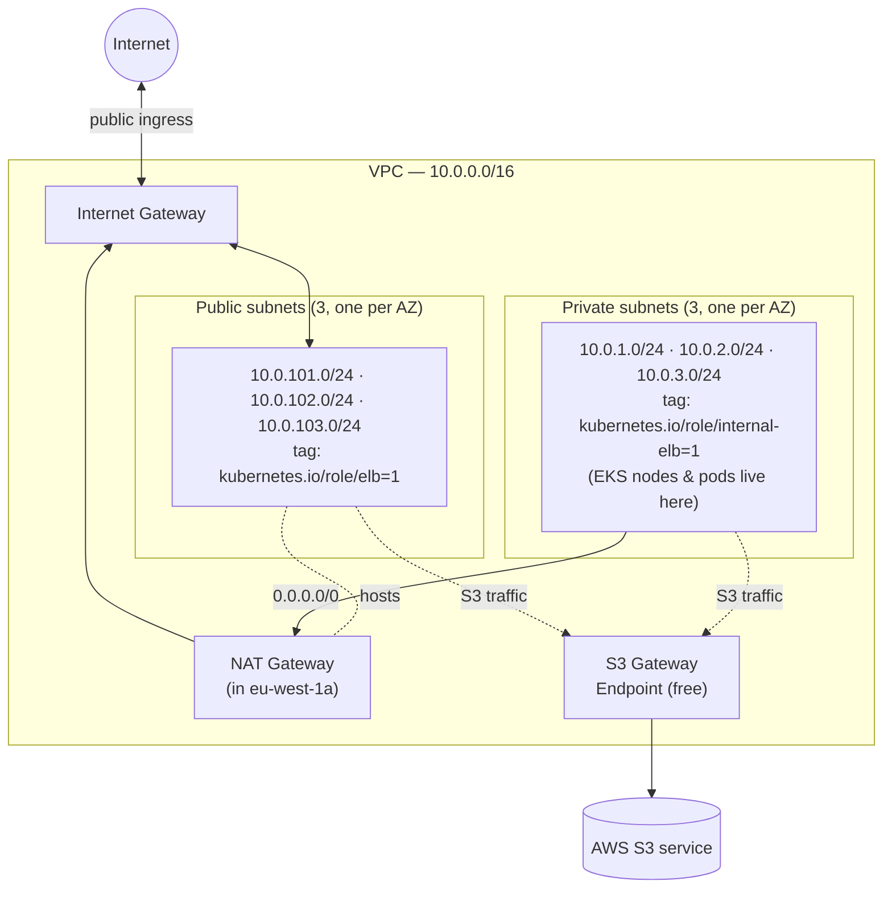
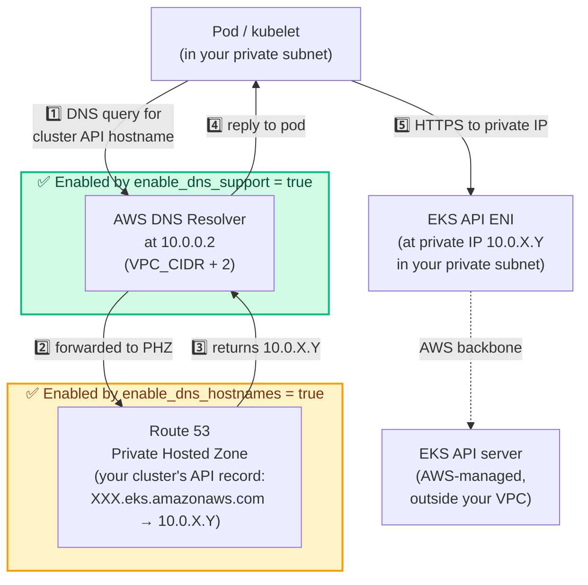

# Day 2 — VPC Networking

A learning-oriented walkthrough of the VPC we built. Re-read whenever you forget *why* a piece is there.

> **TL;DR.** One VPC across three AZs in `eu-west-1`. Each AZ has a public + private subnet. EKS nodes will run in the private subnets. Outbound internet via a single NAT Gateway. S3 traffic bypasses NAT via a free Gateway endpoint. **Cost: ~$33/month**, all of it from NAT.

---

## Why a VPC at all?

### What a VPC actually is

A VPC ("Virtual Private Cloud") is your own logically-isolated slice of AWS's network. It's a **software-defined network** that AWS gives you for free, where you control the IP address range, the subnets, the routing rules, and which traffic goes where.

Mechanically, a VPC is an SDN abstraction layered on top of AWS's physical datacenter network. When you create an EC2 instance "in a VPC," AWS plumbs an **ENI** (Elastic Network Interface — a virtual NIC) into one of the VPC's subnets. The ENI gets an IP from that subnet's CIDR. All packets to/from that instance traverse the VPC's routing rules.

Two important properties:

1. **Isolation.** No other AWS customer can route traffic into your VPC unless you explicitly peer with them or expose a service.
2. **Single-region scope.** A VPC lives in exactly one AWS region but can span all AZs in that region.

### Why EKS specifically needs one we control

EKS is "managed Kubernetes," but only the **control plane** is managed (API server, etcd, scheduler — those run in AWS's VPC, not yours). The **data plane** — your worker nodes and pods — runs in *your* VPC, on EC2 instances you own.

For that to work:

1. **AWS injects ENIs into your subnets.** When you create the cluster, AWS provisions ENIs in your private subnets so the control plane can reach your nodes (e.g. `kubectl exec` proxies through these). These ENIs need IPs from your CIDR.
2. **Pod IPs come from your subnet CIDRs.** With the default VPC CNI (which we'll use on Day 3), every pod gets a real VPC IP. A `g4dn.xlarge` node can host ~58 pods, each with its own routable IP. Our /24s with 251 usable IPs each handle that with room to spare.
3. **Subnet tags are how EKS-aware controllers find subnets.** The AWS Load Balancer Controller, when asked to create a public ALB, reads subnet tags `kubernetes.io/role/elb=1` to know which subnets are eligible. No tag = controller refuses to create the LB.
4. **Routing decides node connectivity.** Worker nodes need outbound internet to register with the EKS control plane, pull container images, fetch IAM credentials via STS for IRSA, ship logs, etc. Wrong routing = nodes never reach `Ready`.

If the VPC is wrong on Day 2, every following day breaks in confusing ways. Common downstream symptoms when foundations are off: nodes stuck in `NotReady`, pods stuck in `Pending` or `ImagePullBackOff`, LBs that never get an IP. So we get this right once.

---

## Big picture



---

## Components, one by one

### The VPC

#### CIDR `10.0.0.0/16`

What it is: the IP address space the VPC owns. CIDR notation `/16` means the first 16 bits are the network prefix and the remaining 16 bits are host space.

The math:

```
10.0.0.0/16
^^^^^^^^^^
└── network prefix (fixed: 10.0.x.x)
       └── host bits (variable: 65,536 possible addresses)
```

So this VPC owns every IP from `10.0.0.0` to `10.0.255.255` — 65,536 addresses. We'll use ~1,500 across all subnets. Overkill is free; AWS doesn't charge per IP.

The first octet (`10.x.x.x`) is [RFC 1918](https://datatracker.ietf.org/doc/html/rfc1918) private space — **non-routable on the public internet**, only meaningful inside our VPC. The other RFC 1918 ranges (`172.16.0.0/12`, `192.168.0.0/16`) are equally valid; we use `10.0.0.0/16` because it's the most common convention and gives the largest contiguous space.

A consequence: nothing on the public internet can ever address `10.0.x.x` directly. Inbound traffic from the internet always lands on a public IP and gets translated (by IGW or LB) to the private IP.

#### DNS configuration: `enable_dns_support` and `enable_dns_hostnames`

These are two **separate** VPC-level boolean flags. They look like they're saying the same thing but they aren't, and EKS needs both. Worth understanding properly because when this is misconfigured the symptoms ("nodes won't join cluster", "pods can't get IRSA tokens") don't mention DNS anywhere.

##### `enable_dns_support = true`

What it is: a VPC-level flag that turns on the **AWS-managed DNS resolver** inside the VPC.

What it does mechanically: AWS reserves an IP at `(VPC CIDR base) + 2` and runs a DNS server there. For our `10.0.0.0/16` VPC, that's **`10.0.0.2`**. Every EC2 instance launched in the VPC gets `10.0.0.2` set as its DNS server automatically (via the default DHCP option set). That resolver answers:

- public DNS names (`s3.eu-west-1.amazonaws.com`, `github.com`, …)
- internal EC2 hostnames (`ip-10-0-1-23.eu-west-1.compute.internal`)
- AWS service endpoints
- Route 53 **private hosted zones** associated with this VPC

Turn this off and nothing inside the VPC can resolve *any* name unless you bring your own resolver. AWS default for new VPCs: on. We leave it on.

##### `enable_dns_hostnames = true`

What it is: another VPC-level boolean. The name is misleading — it controls more than hostnames.

What it does mechanically:

1. **Auto-assigns DNS names to EC2 instances** in this VPC. An instance gets an internal hostname like `ip-10-0-1-23.eu-west-1.compute.internal`. If it has a public IP, it also gets a public DNS name (`ec2-…compute.amazonaws.com`).
2. **Enables resolution of Route 53 private hosted zones** associated with the VPC. *This is the critical effect for EKS.* Without this flag, queries against a private hosted zone return `NXDOMAIN` even though `enable_dns_support` is on and the resolver is happily answering everything else.

AWS default for newly-created VPCs: **off**. The terraform-aws-modules/vpc module turns it on for us.

##### Why EKS specifically needs both

On Day 3 we'll create an EKS cluster with `endpoint_private_access = true`. To understand what the flags actually enable, you need to separate **three things** AWS sets up. They're often confused with each other, but they live in different places and play different roles:

| Thing | What it is | Where it lives |
|---|---|---|
| **EKS control plane** | The actual Kubernetes API server, etcd, scheduler — the things doing the work | An **AWS-managed VPC**, completely separate from yours |
| **EKS API ENI** | A network interface with a private IP, that AWS plumbs through to the control plane behind the scenes | **Your** private subnet |
| **Private Hosted Zone (PHZ)** | A Route 53 DNS zone — basically an address book mapping the cluster's hostname → the ENI's private IP | Route 53, *associated* with your VPC (not "inside" it) |

> **The PHZ isn't where the control plane runs.** It's the phone book that points kubelets and pods at the ENI in your subnet, which is itself the entry point AWS plumbs through to its own managed control plane.

The full chain when a kubelet wants to talk to the API:

```
DNS flags ON
  → kubelet resolves XXX.gr7.eu-west-1.eks.amazonaws.com via the PHZ
     → gets back 10.0.X.Y (the ENI's private IP, in YOUR subnet)
        → opens TCP/443 to 10.0.X.Y
           → AWS plumbing forwards to the actual API server in AWS's VPC
```

If either DNS flag is off, the chain dies at step 1 — the kubelet can't even find the IP to connect to. Symptoms appear at the *node-joining* layer ("kubelet can't reach API"), not at the DNS layer ("lookup failed"), which is why the failure mode is so confusing.

##### This isn't the only PHZ in the picture

The same DNS-flag dependency hits **other** PHZs throughout the project:

1. **IRSA / OIDC issuer URL.** When a pod assumes its IAM role (Day 5), it calls the cluster's OIDC issuer endpoint, which is *also* published in a PHZ. Same flags required; same `NXDOMAIN` if either is off → STS denies the AssumeRoleWithWebIdentity call → pod has no AWS credentials.
2. **Any custom PHZ you create yourself** — for service discovery, internal-only hostnames, multi-VPC service routing, etc.

For anything inside the VPC — kubelet on a worker node, an in-cluster pod doing IRSA, you running `kubectl` from a bastion — to reach the cluster API or any other PHZ-resolved endpoint, the DNS lookup must succeed.

##### What each flag enables, visually

The two green boxes are the two pieces of AWS infrastructure that **only exist because of the matching flag**. If a flag is `false`, its box disappears, and the numbered arrows passing through it break.



Reading the diagram:

| If you turn off… | …this box disappears | …which breaks | …and you see |
|---|---|---|---|
| `enable_dns_support` | the green Resolver box | arrows 1️⃣ + 4️⃣ (and everything after) | nothing in the VPC can resolve any DNS at all |
| `enable_dns_hostnames` | the orange PHZ box | arrows 2️⃣ + 3️⃣ | DNS works for public names but `NXDOMAIN` for the cluster's hostname |

Both flags are gates on different steps of the *same* lookup. Either one off → the chain breaks at that step.

If either flag is off, the lookup fails. Symptoms you'd see (none of which mention DNS):

- Worker nodes stuck in `NotReady`, `kubelet` logs say "failed to get node lease" / "no such host"
- IRSA-enabled pods can't get tokens (STS call fails because the cluster's OIDC issuer URL doesn't resolve)
- `kubectl get nodes` from inside the VPC times out

Cost of having these on: zero. They're just config toggles. There's no practical reason ever to turn them off in an EKS VPC.

---

### Availability zones (3)

#### What an AZ actually is

An AWS Availability Zone is one or more physically distinct datacenters within a region. Each AZ has:

- **Independent power** (different substations, separate generators, separate UPS infrastructure).
- **Independent cooling**.
- **Independent network spine** — its own internet uplinks and connection to AWS's global backbone.
- **Low-latency interconnect** to other AZs in the same region (typically <2 ms round-trip), but far enough apart geographically that one fire/flood/blackout doesn't take out neighbors.

An AZ is at minimum one datacenter; commonly several datacenters that share the AZ identifier and are treated as a single fault domain.

#### Why three?

Three is the sweet spot for fault-tolerance design:

| AZ count | Survives 1 AZ outage? | Quorum-capable? | Notes |
|---|---|---|---|
| 1 | no | no | Single point of failure |
| 2 | partially | no | Quorum systems (etcd, Raft) need ≥3 |
| **3** | **yes** | **yes** | **Standard for production EKS** |
| 4+ | yes | yes | Diminishing returns; not all regions support |

EKS *requires* the cluster's subnets to span at least two AZs and *recommends* three. The control plane (managed by AWS) is itself spread across three AZs internally.

#### Why dynamic AZ selection?

```hcl
data "aws_availability_zones" "available" {
  state = "available"
}

locals {
  azs = slice(data.aws_availability_zones.available.names, 0, 3)
}
```

Two reasons:

1. **AZ names are shuffled per-account.** Your `eu-west-1a` is *not* the same physical datacenter as someone else's `eu-west-1a` — AWS deliberately randomizes the mapping per account so customers don't all pile into "AZ-a" thinking it's the same place. The `data` source returns whatever the active mapping is for *this* account.
2. **Some AZs may be unavailable.** Either temporarily (regional issues) or permanently (newer accounts may not have access to legacy AZs AWS is winding down). The `state = "available"` filter handles both.

---

### Subnets (6 total)

#### What a subnet actually is

A subnet is a chunk of the VPC's IP space, scoped to a single AZ. Every ENI in the VPC lives in exactly one subnet. The subnet determines:

1. **Which IPs an ENI can be assigned** — picked from the subnet's CIDR.
2. **Which AZ the resource is in** — a subnet belongs to exactly one AZ.
3. **Which routing applies** — each subnet is associated with exactly one route table, which determines where its outbound traffic goes.

A subnet does *not* determine security — that's security groups (per-ENI) and NACLs (per-subnet, separate from routing).

#### Our 6 subnets

| Subnet | AZ | CIDR | Usable IPs | EKS tag | Role |
|---|---|---|---|---|---|
| public-1 | eu-west-1a | 10.0.101.0/24 | 251 | `kubernetes.io/role/elb=1` | Hosts the NAT GW. Public LBs land here. |
| public-2 | eu-west-1b | 10.0.102.0/24 | 251 | `kubernetes.io/role/elb=1` | Public LBs. |
| public-3 | eu-west-1c | 10.0.103.0/24 | 251 | `kubernetes.io/role/elb=1` | Public LBs. |
| private-1 | eu-west-1a | 10.0.1.0/24 | 251 | `kubernetes.io/role/internal-elb=1` | EKS nodes + pods. |
| private-2 | eu-west-1b | 10.0.2.0/24 | 251 | `kubernetes.io/role/internal-elb=1` | EKS nodes + pods. |
| private-3 | eu-west-1c | 10.0.3.0/24 | 251 | `kubernetes.io/role/internal-elb=1` | EKS nodes + pods. |

#### The 5 reserved IPs in every subnet

A /24 has 256 addresses but only 251 are usable. AWS reserves five at fixed offsets:

| Offset | Example (in `10.0.1.0/24`) | Reserved for |
|---|---|---|
| `+0` | `10.0.1.0` | Network address (CIDR convention — all-zero host bits, never assignable) |
| `+1` | `10.0.1.1` | VPC router (the implicit gateway every subnet routes through) |
| `+2` | `10.0.1.2` | DNS resolver pointer (per-subnet reservation; the actual VPC resolver lives at `VPC_CIDR + 2`, i.e. `10.0.0.2`) |
| `+3` | `10.0.1.3` | Reserved by AWS for future use |
| `−1` | `10.0.1.255` | Broadcast (CIDR convention — all-ones host bits; AWS doesn't actually broadcast, but the slot is reserved) |

So the first usable IP in `10.0.1.0/24` is `10.0.1.4`.

This is the reason a /28 subnet (16 addresses) only gives you 11 usable — same five reservations.

#### Public vs private subnet — what actually differs

The names "public" and "private" are *not* AWS concepts. There's no boolean on a subnet that says `is_public = true`. The distinction is purely a route-table convention:

| Flavor | Default route in its route table | Resources here can... |
|---|---|---|
| "public" | `0.0.0.0/0 → IGW` | initiate AND receive internet connections (if they have a public IP / EIP) |
| "private" | `0.0.0.0/0 → NAT GW` | only initiate outbound internet connections |

A subnet becomes "public" the moment its route table has an IGW route, and "private" the moment its route table has a NAT route instead. That's the entire technical distinction. The `kubernetes.io/role/...` tags layered on top are just a Kubernetes convention used by AWS LB Controller, not an AWS-networking concept.

EKS workloads belong in private subnets so the pods are never directly reachable from the internet. The only public surface is the Load Balancer, which lives in public subnets and forwards (via VPC-internal traffic) to private pods.

#### Why /24?

A /24 subnet has 256 IPs (251 usable). For our POC:

- Each EKS node uses one IP for itself (kubelet, system).
- Each pod gets one IP from the subnet (default VPC CNI behavior).
- A `g4dn.xlarge` can host up to 58 pods, so 1 node ≈ 59 IPs.
- Worst-case POC: 3 GPU nodes × 59 IPs = 177 IPs in one subnet. Still fits comfortably in 251.

Smaller (e.g. /28 = 11 usable) wouldn't fit. Larger (e.g. /20 = 4091 usable) is fine but wastes /24-sized slots in the VPC's `10.0.0.0/16` for no benefit. /24 is the human-friendly default.

#### Why public is `10.0.10X.0/24` and private is `10.0.X.0/24`?

Pure convention. AWS sees the CIDRs as identical types of address space; nothing about the values affects behavior. The `1xx`-vs-`x` split makes them visually distinct in the console listing. Anything would work as long as CIDRs don't overlap.

#### The two `kubernetes.io/role/...` subnet tags

Used by the **AWS Load Balancer Controller** — an in-cluster controller AWS publishes that watches Kubernetes Service/Ingress objects and provisions corresponding AWS load balancers.

| Tag | Read by | Effect |
|---|---|---|
| `kubernetes.io/role/elb=1` | AWS LB Controller | "Eligible for *internet-facing* LBs." |
| `kubernetes.io/role/internal-elb=1` | AWS LB Controller | "Eligible for *internal* LBs (VPC-only)." |

When you create a Kubernetes `Service` of type `LoadBalancer` (Day 9: FastAPI), the controller does:

1. Read the Service's `aws-load-balancer-scheme` annotation: `internet-facing` or `internal`?
2. Find subnets in this VPC tagged for that role.
3. Provision the LB with one ENI per AZ in those subnets.

Without the tag, the controller can't decide which subnets to use, the LB doesn't get created, and the Service hangs with no external IP. The error appears in the controller pod's logs, not on the Service object — easy to miss if you don't know to look.

We tag both sides so future LB types (internal or external) "just work" without re-tagging.

---

### Internet Gateway (IGW)

#### What it actually is

Despite the name, an IGW isn't a discrete piece of hardware. It's a **logical AWS networking construct**, horizontally scaled across each AZ, that performs **source NAT** for instances with public IPs.

What this means concretely:

- An EC2 instance with public IP `54.x.y.z` and private IP `10.0.101.5` sends a packet to `8.8.8.8`:
  1. Packet leaves instance with source = `10.0.101.5`.
  2. Route table directs `0.0.0.0/0` → IGW.
  3. The IGW rewrites source to `54.x.y.z` (the public IP).
  4. Packet exits AWS toward `8.8.8.8`.
  5. Reply comes back to `54.x.y.z`. The IGW rewrites destination back to `10.0.101.5` and delivers it.

The instance's OS only ever sees `10.0.101.5`. The "public IP" is plumbed by AWS infrastructure, not by the OS.

#### Why one IGW

A VPC can have at most one IGW attached. AWS scales it horizontally — there's no throughput or connection limit you'd hit at our scale.

Free.

#### IGW vs NAT — both move outbound traffic, what's the difference?

| | IGW | NAT GW |
|---|---|---|
| Used by | instances *with* a public IP | instances *without* a public IP |
| Direction | bidirectional (in and out) | outbound-only |
| Source rewrite | uses the instance's own EIP | uses the NAT's shared EIP |
| Cost | free | $0.045/hour + per-GB |

A subnet typically uses *one* of them, not both. Public subnets route outbound to IGW, private subnets to NAT GW (which itself eventually exits via IGW).

#### What breaks without an IGW

No subnet in the VPC can reach the internet, full stop. Even creating a NAT GW would be pointless since the NAT GW itself exits via IGW. Terraform would also fail trying to create the public route table's `0.0.0.0/0 → IGW` route.

---

### NAT Gateway

The only thing in this VPC that costs money.

#### What it is

A managed AWS service that performs **source NAT** for outbound-only traffic from private subnets. It's the AWS-managed equivalent of running a Linux router with `iptables -t nat MASQUERADE` — except you don't manage anything; AWS scales and patches it.

#### What it does mechanically

When a pod in a private subnet (IP `10.0.1.50`) opens a TCP connection to `1.1.1.1:443`:

1. Packet leaves pod with source = `10.0.1.50:34521` (random ephemeral port).
2. Route table sends `0.0.0.0/0` → NAT GW.
3. NAT GW allocates one of *its* ephemeral ports (say `54443`) and rewrites source = `<NAT EIP>:54443`. It records the mapping `<NAT EIP>:54443 ↔ 10.0.1.50:34521` in a **connection-tracking table**.
4. Packet exits via IGW → internet → reaches `1.1.1.1:443`.
5. Reply comes back to `<NAT EIP>:54443`. NAT GW looks up the mapping, rewrites destination to `10.0.1.50:34521`, delivers via the VPC.

The connection-tracking table is what makes NAT outbound-only: no entry exists until the pod initiates, so unsolicited inbound packets have nowhere to go.

#### Where ours lives

One NAT GW, in **public subnet `eu-west-1a`** (the first public subnet). It has:

- An ENI in that public subnet (so it can reach the IGW).
- An Elastic IP attached. The EIP is what shows up as the source address on the public internet.

All three private subnets route `0.0.0.0/0` to this single NAT GW.

#### Capacity / limits worth knowing

| Limit | Value | Practical relevance |
|---|---|---|
| Bandwidth | starts at 5 Gbps, auto-scales to 100 Gbps | We won't hit this. |
| Concurrent connections | ~900,000 | We won't hit this. |
| Per-destination port exhaustion | ~55,000 simultaneous connections to a single `(dest IP, dest port)` | Matters if many pods hammer the same external endpoint. We're nowhere near. |

#### Cost

| Component | Rate | Monthly (24/7) |
|---|---|---|
| NAT Gateway hourly | $0.045 / hr | ~$32.40 |
| Data processing | $0.045 / GB processed | depends |
| Elastic IP (while attached) | $0 | $0 |

(EIPs cost $0.005/hr when *unattached*. Always attached → free. The NAT GW always has its EIP attached.)

#### Why one NAT, not three?

| Option | Cost/month | Failure mode |
|---|---|---|
| **1 NAT (ours)** | ~$32 | If `eu-west-1a` goes down, all private subnets lose internet (they all route through the single NAT in AZ-a) |
| 3 NATs (one per AZ) | ~$96 | AZ-isolated; one AZ outage doesn't affect others |

We chose 1. POC budget is $130–160 — paying $96/month for AZ-redundant NAT would eat 60% of the budget for fault tolerance we don't need in a personal POC. In production, you'd always do 3.

---

### S3 Gateway Endpoint

The free win.

#### What it is

A "Gateway Endpoint" is one of two flavors of VPC Endpoint (the other is Interface Endpoint — covered below). It's a **routing-level shortcut** to a specific AWS service that bypasses the IGW/NAT entirely.

Available only for **S3 and DynamoDB**. Free.

#### What it does mechanically

Two things happen when you create one:

1. **AWS adds a managed prefix list** to the route tables you specify. A *prefix list* is a named, AWS-maintained set of IP prefixes. For S3 in `eu-west-1` it's something like `pl-6da54004` — about 50 CIDR blocks covering S3's public IP ranges, updated by AWS over time without you touching anything.
2. **The endpoint becomes the next-hop target** for traffic to those prefixes. The route table entry looks like: `pl-6da54004 → vpce-XXXXXXXX`.

When a pod calls `s3.eu-west-1.amazonaws.com`:

1. DNS resolves the hostname to an S3 IP (a public S3 IP — same as without the endpoint).
2. Route table evaluates routes; longest-prefix-match wins.
3. Instead of `0.0.0.0/0 → NAT/IGW`, the packet matches `pl-... → vpce-XXX` and takes that route.
4. The endpoint forwards the request to S3 over AWS internal network. Traffic never leaves the AWS backbone.

Crucially: **DNS doesn't change.** You still call `s3.eu-west-1.amazonaws.com`. Only the *routing* of the resulting packet changes.

#### Why we attach it to both private and public route tables

Private RT — the obvious case: saves NAT data charges on S3 traffic, faster path.

Public RT — doesn't save money (public subnets already have free outbound to S3 via IGW) but slightly faster (fewer hops, AWS backbone instead of public-internet path) and consistent. No downside.

#### Why we care for *this* project

ECR stores container image layers in S3. When EKS pulls the 20 GB Merlin image:

```
ECR API metadata (~few KB) ─→ NAT ─→ ECR API
Image layer bytes (~20 GB) ─→ S3 Gateway Endpoint ─→ S3
```

Without the endpoint, those 20 GB would flow through NAT — roughly $0.90 in NAT data processing per pull. Trivial for one pull, but every autoscaling cycle that recreates a node re-pulls the image, and that adds up.

With the endpoint, image bytes stay on AWS backbone — faster *and* free.

#### Gateway vs Interface endpoints — fundamental difference

| | Gateway Endpoint | Interface Endpoint |
|---|---|---|
| Services covered | S3, DynamoDB *only* | most other AWS services (ECR API, STS, SQS, Logs, …) |
| Mechanism | Route table entry + prefix list | Private ENI(s) provisioned in your subnets |
| DNS | Unchanged (still public hostname) | Optional "private DNS" feature hijacks the AWS service hostname to resolve to private IPs of the endpoint ENIs |
| Cost | **Free** | $0.01/hr per endpoint per AZ + $0.01/GB |
| Throughput | Inherits VPC throughput | Inherits per-ENI limits |

For 3 AZs, a single interface endpoint costs ~$21/month. You'd need to skip many of them to come out ahead of NAT. For this POC, NAT + the free S3 gateway is the optimum.

---

### Default SG / NACL / RT — what the module does

Every new VPC ships with a default Security Group, default Network ACL, and default Route Table. The module **takes ownership** of all three (so they appear in Terraform state and are managed declaratively), but only one of them actually gets *locked down*.

| Resource | AWS factory state | What the module sets | Net effect |
|---|---|---|---|
| **Default Security Group** | Inbound: allow from same SG. Outbound: allow all. | **No rules in either direction** | **Locked down — denies everything** |
| Default Network ACL | Allow-all in/out (v4 + v6) | Allow-all in/out (v4 + v6) | Unchanged from factory |
| Default Route Table | `local` route only (implicit) | `local` route only, just tagged | Unchanged from factory |

So the actual security hardening is **only on the default SG**. NACLs are stateless and easy to lock yourself out with — the module deliberately leaves the default NACL permissive and relies on SGs (per-ENI, stateful) for actual access control. The default RT is only tagged for visibility because no subnet of ours is associated with it anyway.

#### Why the locked-down default SG matters

If anything is ever created in this VPC without explicit SG configuration — say you spin up an RDS instance and forget to specify SGs — that resource falls back to the default SG. With AWS's factory default, it'd silently inherit broad intra-VPC access. With the module's empty default SG, it has **no allowed traffic at all**, fails closed, and you notice immediately.

You normally never see this in operation; it's hygiene that pays off the day someone (you, in 6 months) forgets to specify an SG.

---

## Routing tables — the actual rules

### Public route table (one, shared by all 3 public subnets)

| Destination | Target | Why |
|---|---|---|
| `10.0.0.0/16` | local | Talk inside the VPC |
| `pl-…` (S3 prefix list) | `vpce-…` (S3 endpoint) | Stay on AWS backbone for S3 |
| `0.0.0.0/0` | IGW | Direct internet egress |

### Private route table (one, shared because `single_nat_gateway = true`)

| Destination | Target | Why |
|---|---|---|
| `10.0.0.0/16` | local | Talk inside the VPC |
| `pl-…` (S3 prefix list) | `vpce-…` (S3 endpoint) | Stay on AWS backbone for S3 |
| `0.0.0.0/0` | NAT GW | Indirect outbound internet via NAT |

> The `local` route is implicit — AWS adds it automatically to every RT. You can't see it in Terraform, but it's there. Routing in AWS uses **longest-prefix match**: when multiple routes match a destination, the most specific one wins. That's why the S3 prefix list (specific) beats `0.0.0.0/0` (catch-all) for S3 traffic.

---

## Traffic flow examples

### EKS pod → ECR (pulling an image)

```
pod (private subnet)
  ├─ ECR API call (auth, manifest)  → NAT GW → IGW → ECR API endpoint
  └─ Image layer download (the bulk) → S3 Gateway Endpoint → S3
```

### EKS pod → SQS (worker polling for inference jobs)

```
pod (private subnet) → NAT GW → IGW → SQS endpoint
```

(SQS doesn't have a free Gateway endpoint — it's an Interface endpoint, which we deliberately skipped.)

### Internet user → FastAPI (Day 9)

```
user → public LB (in public subnets, has public IP) → pod (in private subnet, via VPC-internal route)
```

The pod *receives* traffic from the LB but never *initiates* a connection from the internet — totally normal.

---

## Cost summary

| Resource | Hourly | Monthly |
|---|---|---|
| VPC, subnets, route tables, IGW | $0 | $0 |
| Elastic IP (attached to NAT) | $0 | $0 |
| S3 Gateway Endpoint | $0 | $0 |
| **NAT Gateway (baseline)** | **$0.045** | **~$32.40** |
| NAT data processing | $0.045/GB | depends on traffic |

Budgeted: ~$33/month. Real traffic for this POC will add at most a few dollars on top.

---

## FAQ

**Q: Could I delete the NAT each night to save money?**
Technically yes (`terraform destroy -target=…`), but the savings (~$1/day) don't justify the operational friction or the risk of forgetting to recreate it before a session. Just `terraform destroy` everything when the project is over.

**Q: Why didn't we add Interface endpoints for ECR / STS / SQS?**
At ~$7/month per endpoint per AZ × 3 AZs, two or three of them already cost more than the NAT. False economy for a POC. In production with sustained traffic, the per-GB savings flip the math.

**Q: Could I add VPC Flow Logs later?**
Yes. Set `enable_flow_log = true` on the VPC module — logs go to CloudWatch. Useful when something is mysteriously not connecting. Not needed yet.

**Q: What if the AWS LB Controller (later) puts an LB in the wrong subnet?**
It won't, because we tagged subnets correctly. Public LB → subnet with `kubernetes.io/role/elb=1`. Internal LB → subnet with `kubernetes.io/role/internal-elb=1`. The controller reads these tags to choose.

**Q: Can I add more subnets later?**
Yes, but be careful: if you change subnet CIDRs of existing subnets, Terraform replaces them, which forces replacement of dependent resources (NAT GW, EKS nodes, etc.). Adding new subnets in unused CIDR space (we have plenty in `10.0.0.0/16`) is safe.

**Q: Why doesn't the doc mention IPv6?**
We didn't enable it. Adds complexity for no POC benefit. EKS supports dual-stack but it's a Day 30 problem, not a Day 2 one.

---

## What this enables on Day 3

- The EKS module gets `module.vpc.private_subnets` for node placement and `module.vpc.public_subnets` for any public LB integrations.
- Cluster nodes pull their bootstrap and AMI assets from S3 → uses our gateway endpoint. Free + fast.
- Cluster API endpoint runs in private mode, reachable from inside the VPC (DNS hostnames are on, so it resolves).

---

## Where to look in code

- `terraform/vpc.tf` — module call + S3 endpoint resource
- `terraform/providers.tf` — `var.region` (`eu-west-1`) feeds the endpoint's service name
- AWS console: VPC → Your VPCs / Subnets / Route Tables / NAT Gateways / Endpoints

---

## References

- [AWS VPC docs](https://docs.aws.amazon.com/vpc/latest/userguide/what-is-amazon-vpc.html)
- [terraform-aws-modules/vpc README](https://github.com/terraform-aws-modules/terraform-aws-vpc)
- [EKS subnet tagging requirements](https://docs.aws.amazon.com/eks/latest/userguide/network-reqs.html)
- [VPC pricing](https://aws.amazon.com/vpc/pricing/)
- [VPC endpoint types](https://docs.aws.amazon.com/vpc/latest/privatelink/vpc-endpoints.html)
- [RFC 1918 — Private IP space](https://datatracker.ietf.org/doc/html/rfc1918)
