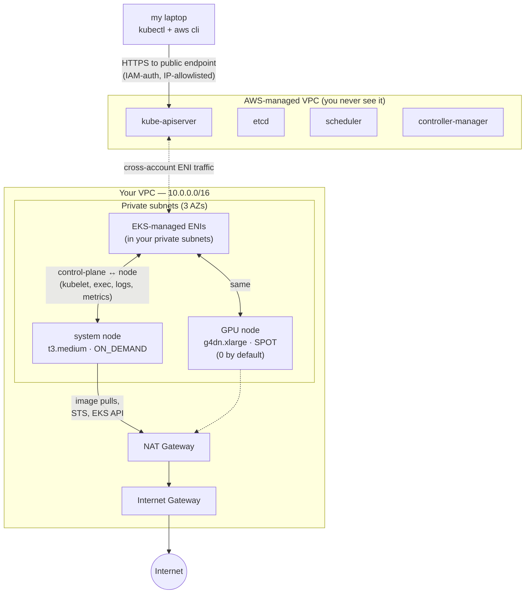
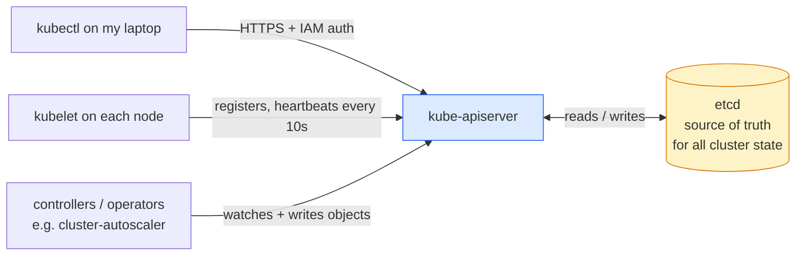
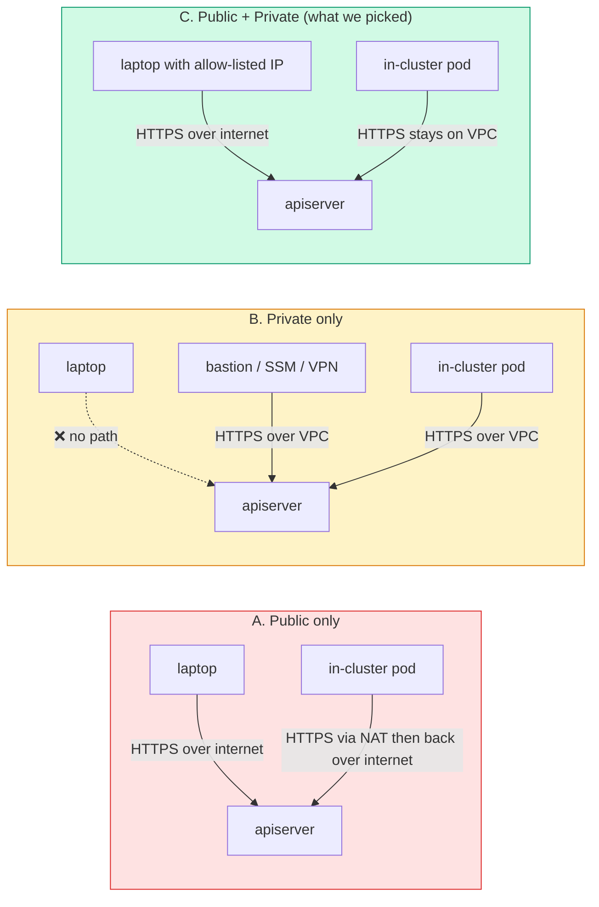
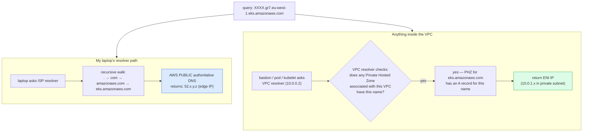
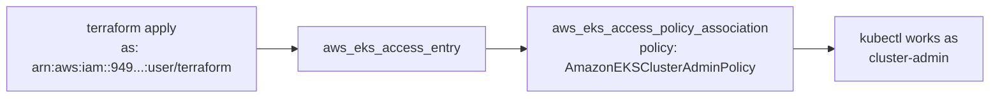
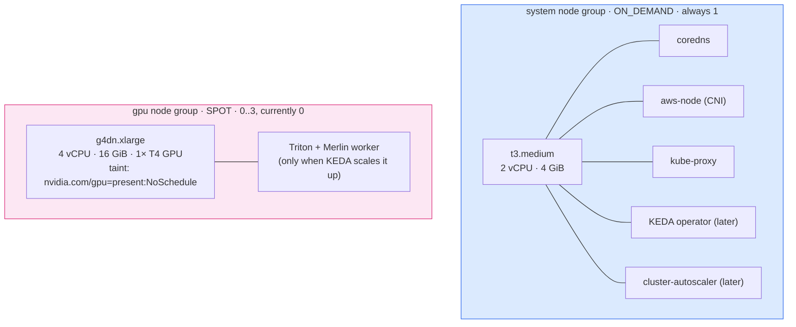
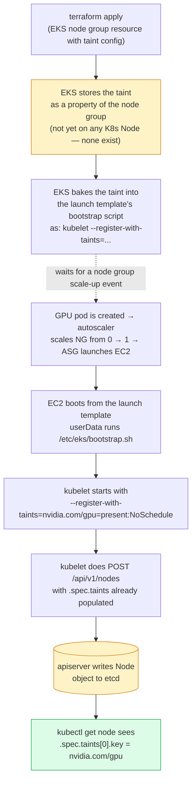
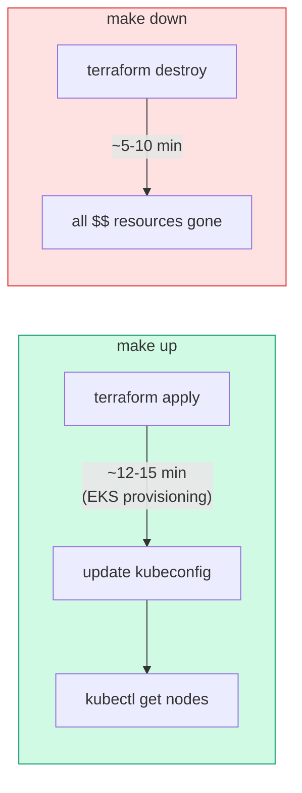

# Day 3 — EKS Cluster

A learning-oriented walkthrough of the EKS cluster we deployed today. Re-read whenever you forget *why* a piece is there.

> **TL;DR.** One EKS 1.30 cluster running in our Day-2 VPC. Two managed node groups: a `t3.medium` system node (always on, runs cluster-internal pods) and a `g4dn.xlarge` GPU node group on Spot, scaled to zero by default. Public API endpoint locked to my home IP, private endpoint enabled so in-cluster traffic stays on the VPC. **Cost: ~$0.20/hour while up.** That's why the `make up` / `make down` ritual exists.

---

## What "EKS" actually is

EKS is two things glued together:

1. **A managed Kubernetes control plane** that AWS runs for you in *their* VPC.
2. **A wire** between that control plane and your VPC, plus a bunch of IAM/auth machinery so kubectl, your nodes, and your pods can all reach the control plane and each other.

What EKS does **not** give you out of the box:

- **Worker nodes.** You bring those. Today: managed node groups (EC2 instances AWS provisions for you using a launch template).
- **CNI / DNS / kube-proxy.** EKS does ship default versions ("addons") of these, but they run as pods on *your* nodes — not in the AWS-managed control plane.
- **Anything in the `kube-system` namespace beyond the addons.** No ingress controller, no metrics server, no autoscaler. We add those later (Day 6).

So a fresh EKS cluster is more of a Kubernetes API endpoint with a pre-wired auth story than a fully working cluster. We make it real by attaching node groups today and addons later.

---

## Big picture



The cluster has *two* halves:

| Half | Where it runs | Who manages it | Costs |
|---|---|---|---|
| **Control plane** (apiserver, etcd, scheduler, controller-manager) | AWS-managed VPC, you never see it | AWS | $0.10/hr per cluster (flat) |
| **Data plane** (your nodes, your pods) | Your VPC, your subnets | You (via Terraform + node groups) | EC2 + EBS + NAT data |

The bridge between halves is a small fleet of **EKS-managed ENIs** that AWS plumbs into your private subnets. Those ENIs let the control plane reach into your VPC (e.g. for `kubectl exec`, `kubectl logs`, webhook calls into in-cluster services).

---

## Where cluster state lives — and who can change it

This is the single most important model to internalise, because it dissolves a bunch of "but who's actually doing this?" confusion later.

**All Kubernetes state lives in `etcd`.** Every Pod, every Node, every ConfigMap, every Secret, every CRD, every taint and label on every resource — it's all rows in etcd. Nothing else in Kubernetes is a source of truth.



The non-obvious rule: **only the apiserver talks to etcd.** Everything else — kubectl, kubelet, controllers, *you* — talks to the apiserver. The apiserver is the single front door, and it does authn (who are you?), authz (what can you do?), validation, and audit logging on every request before anything reaches etcd.

For our cluster specifically:

- **etcd and apiserver run in AWS's managed VPC.** You don't see the etcd machines, you don't ssh in, you can't query etcd directly. AWS snapshots it, encrypts it at rest, restores during failures.
- **The apiserver is reachable via the EKS DNS name** (`XXXX.gr7.eu-west-1.eks.amazonaws.com`). That's the only way in.
- **Your kubelets, your controllers, your kubectl all hit that DNS name.** Same endpoint, same auth path, same etcd behind it.

### "AWS manages the control plane" vs. "I manage the cluster" — these are different things

| Concept | What it means | Who has the keys |
|---|---|---|
| **Managing the control plane** | Running etcd, the apiserver, the scheduler, the controller-manager. Patching them. Scaling them. Cert rotation. K8s version upgrades. | AWS (you pay $0.10/hr to outsource this) |
| **Mutating cluster state** | Creating/reading/updating/deleting K8s objects via the apiserver. Editing taints, labels, scaling deployments, applying manifests. | You — via the access entry granting `AmazonEKSClusterAdminPolicy` |

AWS runs the building. You decide what's in the rooms. Your access entry hands you a master keycard to your floor.

This matters because it explains why "AWS-managed control plane" doesn't restrict what you can do operationally — you have full kubectl power on day one, exactly as if you'd installed Kubernetes from scratch on your own VMs.

### Who writes which fields on a Node object

When we look at a Node object in etcd (via `kubectl get node x -o yaml`), it's a single document but multiple actors write different parts of it:

| Field | Written by | When |
|---|---|---|
| `.metadata.name` | kubelet | At first registration (`POST /api/v1/nodes`) |
| `.spec.taints` | kubelet (`--register-with-taints` flag) — *or* you with `kubectl taint node ...` — *or* a controller | At registration, or any time later |
| `.metadata.labels` | kubelet (`--node-labels` flag) — *or* you — *or* a controller | At registration, or any time later |
| `.spec.providerID` (e.g. `aws:///eu-west-1a/i-0abc...`) | cloud-controller-manager (runs in the AWS-managed control plane) | Shortly after registration |
| `.status.conditions` (Ready, MemoryPressure, DiskPressure, …) | kubelet | Every ~10s heartbeat |
| `.status.allocatable` (CPU, memory, `nvidia.com/gpu`) | kubelet (using info from device plugins) | At registration + when device plugins update |
| `.status.addresses` (internal/external IPs) | kubelet + cloud-controller-manager | At registration |

Two things that fall out of this:

1. **Taints aren't really "on the node" the way a file is on a disk.** They're a field on the Node *document* in etcd, written there by whoever has API write permission on that document. The node itself (the EC2 instance) doesn't know or care about its own taints.
2. **The kubelet is the most prolific writer to a Node object.** It owns `.status.*` and writes the initial `.spec.taints` / `.metadata.labels` from its bootstrap flags. After that, anyone (you, a controller) can write `.spec.taints` too — kubelet doesn't "own" the field, it just sets the initial value.

We'll come back to this when we talk about how the GPU taint actually gets applied.

---

## API endpoint access modes — the design call we made

This was the one decision today that wasn't already on the plan. EKS has three ways to expose its API server, and the right answer depends on how you operate.



What each mode literally does:

- **`cluster_endpoint_public_access = true`** — AWS publishes a public DNS name for the API server (`https://XXXX.gr7.eu-west-1.eks.amazonaws.com`) that resolves to AWS's edge. Anyone on the internet can hit it; IAM auth still gates *what* they can do, and `cluster_endpoint_public_access_cidrs` gates *whether they can connect at all*.
- **`cluster_endpoint_private_access = true`** — AWS creates a Route 53 Private Hosted Zone in your VPC mapping the same DNS name to the **EKS-managed ENI IPs** in your private subnets. Anything with a route to those ENIs (read: anything in the VPC) reaches the API without traversing the internet.

Crucially, **both can be on at the same time**, and that's what we did. The same DNS name resolves differently depending on where the resolver is:

- From my laptop: public Route 53 → AWS edge IP → IAM check → CIDR check → apiserver.
- From a pod in the cluster: VPC's resolver checks the PHZ first → private ENI IP → packets stay on the VPC.

That's option **C**. We get kubectl from my laptop with a CIDR allowlist *and* keep the heavy in-cluster traffic (kube-proxy refreshes, controller reconciles, webhook calls) on the VPC backbone.

The CIDR list lives in `terraform.tfvars` (gitignored) so my home IP isn't in source control. If my IP changes I run `make ip` to grab the new one and update the file.

> The plan file said "private endpoint" — that wording is satisfied by `cluster_endpoint_private_access = true`. It doesn't mean "private only", it means "private path exists". Don't confuse "private endpoint enabled" with "public endpoint disabled".

### How the same DNS name can resolve to different IPs (split-horizon DNS)

This is the bit that feels like magic until you see it. **There isn't one DNS record. There are two records, in two different DNS systems, with the same name.** Which system you reach depends on the resolver you ask. The technique is called *split-horizon DNS* (a.k.a. split-brain DNS).



What AWS does for you when `cluster_endpoint_private_access = true`:

1. **Public side (always done if `endpoint_public_access = true`)** — registers the cluster's DNS name in AWS's public authoritative zone for `eks.amazonaws.com`, pointing to AWS edge IPs. This is what your laptop reaches.
2. **Private side** — creates a **Route 53 Private Hosted Zone** named `eks.amazonaws.com` and *associates it with your VPC*. Inside that PHZ, an A record for the same cluster DNS name points to the **EKS-managed ENI IPs** in your private subnets.

The VPC resolver (`VPC_CIDR + 2`, so `10.0.0.2` for us) is wired with one important rule: **before going out to public DNS, check any Private Hosted Zones associated with this VPC.** If a PHZ has the name, return *that* answer and stop. Public DNS is never consulted.

So:

- Laptop → ISP resolver → public DNS hierarchy → public edge IP. ✅
- Bastion / pod / kubelet inside the VPC → VPC resolver → PHZ hit → ENI IP. ✅

Same hostname. Two truths, depending on who's asking.

This is the same mechanism behind:

- **Corporate intranet DNS** — `intranet.acme.com` resolves to a private IP from the office, NXDOMAIN from your home wifi.
- **`/etc/hosts` overrides** — same idea, just at the host level instead of the resolver level.
- **dnsmasq / unbound** with internal zones at home.

The "DNS" you learned about as a global namespace is more like a *protocol*. Anyone can stand up an authoritative server for any name — what matters is whose answer your resolver trusts. AWS gets to put a PHZ "in front of" public DNS for your VPC because **the VPC resolver is theirs to configure**.

### What if we wanted a bastion instead of public access?

A bastion would use **the exact same private path as the pods**. There aren't separate "pod endpoints" and "bastion endpoints" — the bastion is just another EC2 instance in the VPC, asking the VPC resolver, hitting the PHZ, getting the ENI IP. Identical wire path to a kubelet's traffic.

The only thing that changes per-caller is **auth**: a bastion still needs IAM credentials and a matching access entry to *do* anything. The endpoint is just a TCP destination — IAM is the gate.

This is also why `cluster_endpoint_public_access = false` (private only) is a genuinely operable choice — the bastion path works without any public endpoint at all. We just chose not to bother because the CIDR-allowlisted public endpoint solves the same problem in zero ops.

---

## Authentication: Access Entries (the v20 way)

This is the bit that bites people coming from older EKS docs.

### How it used to work (pre-2023)

To grant an IAM principal access to the cluster, you'd edit a ConfigMap in `kube-system` called `aws-auth`:

```yaml
mapUsers:
  - userarn: arn:aws:iam::123:user/vasco
    username: vasco
    groups: [system:masters]
```

Problems with that model:

- **Bootstrap chicken-and-egg.** The IAM principal that creates the cluster is the only one who can edit the ConfigMap initially. Lose that, lose the cluster.
- **Out-of-band from Terraform.** Editing a ConfigMap from Terraform required hacky workarounds (`kubernetes` provider, ordering issues, cluster has to be reachable for the apply to succeed).
- **No discoverability.** Nothing in the AWS console told you who could reach the cluster — the answer lived in a YAML blob inside Kubernetes.

### How it works now (EKS Access Entries, v20+ of the module)

Access is now a **first-class AWS API**: `aws eks list-access-entries`, `aws eks create-access-entry`, etc. They're real Terraform resources (`aws_eks_access_entry`, `aws_eks_access_policy_association`).

In our config:

```hcl
enable_cluster_creator_admin_permissions = true
```

This single flag tells the module to create an access entry for the IAM principal running `terraform apply` and associate it with the AWS-managed `AmazonEKSClusterAdminPolicy`. After apply, my `terraform` IAM user can run kubectl as cluster-admin. No ConfigMap editing, no extra steps.



When we add IRSA on Day 5, the OIDC provider plugs into the same access-entry world: a pod's service account, signed by the cluster's OIDC issuer, can be mapped to an IAM role, and that role can hold its own access entry if it needs cluster API access.

---

## Node groups

EKS gives you three ways to bring compute. We're using *managed node groups* for both.

| Option | What it is | When to use |
|---|---|---|
| **EKS-managed node group** (us) | EKS provisions an ASG of EC2 instances using an AWS-curated launch template. EKS handles the AMI, bootstrap, and join-the-cluster wiring. | Default choice. 95% of clusters. |
| Self-managed node group | You build the AMI, the launch template, and the bootstrap script. ASG is yours. | Only if you need a custom AMI or kernel. |
| Fargate | Per-pod serverless compute. No node management, no GPUs. | Burst workloads. Useless for us — no GPU support, no DaemonSets. |

We have two node groups because they have different jobs:



### System node group

- **`t3.medium` × 1, ON_DEMAND.** ~$33/mo if it ran 24/7. With teardown ritual, ~$3-5/mo.
- **No HA.** A real cluster runs system pods on at least 2 nodes across 2 AZs. We accept the SPOF for the POC. The plan note ("saves ~$30/mo") is the only justification.
- **What lands here:** anything that doesn't tolerate the GPU taint, including everything in `kube-system` and the operators we install on Day 6 / Day 15.

### GPU node group

- **`g4dn.xlarge`, SPOT, min:0 max:3, desired:0.** Idle cost: $0. Paying-cost only when we have GPU pods.
- **`ami_type = "AL2_x86_64_GPU"`.** This is critical. The GPU AMI bakes in the NVIDIA driver. Use the regular `AL2_x86_64` AMI and you'll have a GPU instance with no driver, and the device plugin will report 0 GPUs. EKS will happily run a pod requesting `nvidia.com/gpu: 1` indefinitely in `Pending`.
- **Taint `nvidia.com/gpu=present:NoSchedule`.** Stops random pods from landing on a $0.50/hr GPU node. Only pods with a matching toleration can schedule here. We add the toleration to the worker deployment on Day 13.
- **Label `nvidia.com/gpu=true`.** Lets us write `nodeSelector: nvidia.com/gpu: "true"` on pods that *must* go to GPU nodes. Belt-and-braces with the taint.

### Why taint *and* label?

Common confusion. The two do opposite things:

- **Taint repels pods that don't tolerate it.** "Nothing schedules here unless it asks."
- **Label attracts pods that select it.** "Anything can schedule here, but pods can ask specifically for me."

A taint without a label means GPU pods need to discover the node by other means. A label without a taint means CPU pods will land on your $0.50/hr GPU node and waste it. Use both, in opposite directions.

### How an "EKS-managed taint" actually works under the hood

We declared the GPU taint in the Terraform node group block:

```hcl
taints = {
  gpu = {
    key    = "nvidia.com/gpu"
    value  = "present"
    effect = "NO_SCHEDULE"
  }
}
```

That's not a Kubernetes-native field — it's an EKS API field. Here's the actual chain of events from `terraform apply` to a tainted Node object visible in `kubectl`:



Two things to internalise:

1. **The taint config in Terraform is just metadata for the launch template.** Until a node actually scales up, no Node object exists, so no taint exists on any K8s Node. The taint "lives" in three places at different times: (a) in EKS's record of the node group, (b) as a flag in the kubelet bootstrap command, (c) as a field on the Node object in etcd once kubelet registers.
2. **From etcd's perspective, an EKS-managed taint is indistinguishable from a `kubectl taint` taint.** Both end up as identical entries in `.spec.taints[]`. The scheduler doesn't know or care who put them there.

### Could I have done the taint myself, without EKS managing it?

Absolutely. Three concrete ways, all of which work on this cluster:

**Method 1 — `kubectl taint node` (ad-hoc)**

```bash
kubectl taint node ip-10-0-1-23.eu-west-1.compute.internal \
  nvidia.com/gpu=present:NoSchedule
```

Your kubectl → apiserver → etcd writes the taint directly to that Node's `.spec.taints`. Same end state. **Lost when the node dies and a fresh one replaces it** — the new node registers clean, with whatever its kubelet bootstrap flags say (which, for an EKS-managed NG, would still be tainted; for a self-managed ASG without the flag, would not).

**Method 2 — self-managed node group**

Drop the `eks_managed_node_groups` block. Build your own launch template + ASG, write the kubelet bootstrap yourself:

```hcl
resource "aws_launch_template" "gpu" {
  image_id = data.aws_ami.eks_gpu.id

  user_data = base64encode(<<-EOT
    #!/bin/bash
    /etc/eks/bootstrap.sh ${aws_eks_cluster.this.name} \
      --kubelet-extra-args '--register-with-taints=nvidia.com/gpu=present:NoSchedule --node-labels=nvidia.com/gpu=true'
  EOT
  )
}
```

This is **literally what EKS managed node groups do for you**, just with the launch template under your direct control. AWS hides this exact `bootstrap.sh` invocation behind the `taints = {...}` block in the module.

**Method 3 — direct API call (just to feel the bare metal)**

```bash
TOKEN=$(aws eks get-token --cluster-name merlins-lair-eks | jq -r .status.token)
ENDPOINT=$(aws eks describe-cluster --name merlins-lair-eks --query cluster.endpoint --output text)

curl -k -H "Authorization: Bearer $TOKEN" \
  -X PATCH \
  -H "Content-Type: application/strategic-merge-patch+json" \
  -d '{"spec":{"taints":[{"key":"nvidia.com/gpu","value":"present","effect":"NoSchedule"}]}}' \
  $ENDPOINT/api/v1/nodes/ip-10-0-1-23.eu-west-1.compute.internal
```

Same end state. kubectl is just a curl wrapper with auth handling.

### The takeaway

**EKS-managed node groups are a convenience layer, not a permission layer.**

- *Convenience*: AWS owns the launch template, regenerates fresh ones with the same taint flags every time the NG churns, keeps the bootstrap script in sync with EKS releases. Taints survive node replacement automatically.
- *Permission*: nothing changes — you have full kubectl power on day one. AWS managing the control plane never restricts what you can do to cluster state.

You could ditch managed node groups tomorrow and run pure self-managed ASGs (or Karpenter, or anything else that boots a kubelet with the right flags). EKS wouldn't notice. The control plane just sees Node objects registering — it doesn't know or care whether the kubelet that registered came from a managed NG, a hand-written ASG, or a bare EC2 you `ssh`'d into and started kubelet on by hand.

Quick sanity check you can run after `apply`:

```bash
# This proves you have full taint control even though AWS runs the control plane
kubectl taint node $(kubectl get nodes -o name | head -1) demo=yes:NoSchedule
kubectl describe node $(kubectl get nodes -o name | head -1) | grep -A1 -i taint
# Taints: demo=yes:NoSchedule

kubectl taint node $(kubectl get nodes -o name | head -1) demo:NoSchedule-
kubectl describe node $(kubectl get nodes -o name | head -1) | grep -A1 -i taint
# Taints: <none>
```

The "control plane being managed" never enters the picture. You're talking to its API like any other K8s cluster.

---

## OIDC issuer — the seed for IRSA

The module enables this by default. The cluster gets an **OIDC issuer URL** that looks like:

```
https://oidc.eks.eu-west-1.amazonaws.com/id/A1B2C3D4...
```

This is a real OIDC identity provider that AWS hosts and signs. It serves a JWKS at `/.well-known/openid-configuration`, just like Google or Auth0.

What it's *for*: every Kubernetes service account in this cluster gets a JWT signed by this issuer. On Day 5 we'll register this issuer as a trusted OIDC provider in IAM (`aws_iam_openid_connect_provider`), and then we can write IAM role trust policies of the form "trust any token from this issuer where `sub == system:serviceaccount:default:my-app`". That role can then grant SQS or S3 permissions to *only* that service account in *only* that namespace.

That's IRSA — IAM Roles for Service Accounts. It's the only sane way to give pods AWS credentials. We'll wire it up on Day 5; today we just get the issuer URL into the outputs so it's ready.

---

## Cluster security group vs. node security group

EKS sets up two SGs by default. Worth knowing the difference because debugging "why can't this pod reach that pod" usually comes down to one of them.

| SG | Attached to | Default rules |
|---|---|---|
| **Cluster security group** | The EKS-managed ENIs in your private subnets | Self-referential allow-all. Anything with this SG can talk to anything else with this SG. |
| **Node security group** (per node group) | EC2 instances in the node group | Allow inbound from cluster SG (so apiserver can reach kubelet on 10250). Outbound: all (so nodes can hit the internet via NAT). |

The module attaches the cluster SG to the nodes too, which is why pods can talk to each other across nodes without extra rules. If you ever break inter-pod traffic, look here first.

---

## What we deliberately skipped (and why)

| Skipped | Cost saved | Why okay for a POC |
|---|---|---|
| **KMS envelope encryption of K8s secrets** (`create_kms_key = false`, `cluster_encryption_config = {}`) | ~$1/mo for the KMS key | We're not storing real secrets. EKS still encrypts etcd at rest with an AWS-managed key — `create_kms_key=false` only opts out of the *customer-managed* KMS layer for K8s `Secret` objects. |
| **Multi-AZ system nodes** | ~$30/mo (would need 2× t3.medium) | One control-plane outage on a personal POC isn't an incident. |
| **Bastion / SSM session manager for private API access** | A day of work + ongoing complexity | The CIDR-locked public endpoint solves the "kubectl from laptop" problem in one variable. |
| **Custom CW log retention** | Pennies | EKS control plane logs default to ON for `audit/api/authenticator`. We'll let the module's defaults stand for now. |
| **Pod Security Admission policies** | $0 — it's just config | Day-25 polish item. We'd lock this down in a real cluster. |

---

## Cost meter — what's running once we apply

| Resource | Hourly | Daily (24h) | Daily (3h up) |
|---|---|---|---|
| EKS control plane | $0.10 | $2.40 | $0.30 |
| 1× t3.medium (system) | $0.0464 | $1.11 | $0.14 |
| NAT Gateway (carryover from Day 2) | $0.045 | $1.08 | $0.14 |
| EBS for system node (20 GiB gp3) | ~$0.002 | $0.05 | $0.05 |
| GPU nodes (idle, desired=0) | $0 | $0 | $0 |
| **Total infra running** | **~$0.20/hr** | **~$4.64/day** | **~$0.63/day** |

The big lesson: the moment you `terraform apply`, the meter is running on the control plane and the system node, whether you're using them or not. That's why `make down` exists. At 3hrs/day with daily teardown we're projecting ~$20/mo for everything before GPU usage. Well inside the $130-160 budget.

---

## What `make up` and `make down` actually do



What survives `make down`:

- The Day-1 manually-created **state bucket** and **DynamoDB lock table** — they're not in Terraform.
- ECR repositories with their images (Day 4). Configurable; we keep them so we don't re-push the 20GB Merlin image every session.
- IAM users. CloudWatch log groups (depending on retention).

What gets destroyed:

- The cluster itself ($0.10/hr meter stops).
- All node groups and EC2 instances.
- The VPC, subnets, NAT Gateway (the other big meter).
- Everything else Terraform provisioned.

What does **not** survive in any usable state:

- Anything you `kubectl apply`'d that's not in Terraform. Manifests applied for debugging are gone. (We don't put dev manifests in Terraform — they'd churn state every time you tweak a YAML.)

That last point is why the plan keeps app manifests out of Terraform. The trade is: faster dev loop, but you have to re-apply manifests after each `make up`. Day 9 onwards we'll script that.

---

## Verification checklist for after apply

```bash
# 1. Cluster is ACTIVE
aws eks describe-cluster --name merlins-lair-eks --query cluster.status

# 2. Kubeconfig works
aws eks update-kubeconfig --region eu-west-1 --name merlins-lair-eks
kubectl get nodes
# expected: 1 node Ready (the t3.medium system), 0 GPU nodes

# 3. System pods running
kubectl get pods -n kube-system
# expected: coredns × 2, aws-node × 1, kube-proxy × 1

# 4. Access entry exists
aws eks list-access-entries --cluster-name merlins-lair-eks
# expected: arn:aws:iam::949...:user/terraform

# 5. OIDC issuer URL exists (Day 5 needs this)
aws eks describe-cluster --name merlins-lair-eks --query cluster.identity.oidc.issuer
```

If `kubectl get nodes` shows `Ready`, the wiring is solid: VPC routes are good, IAM is good, the CNI is talking to the apiserver, the node bootstrap script ran, and the kubelet auth token works. Day 3 done.
