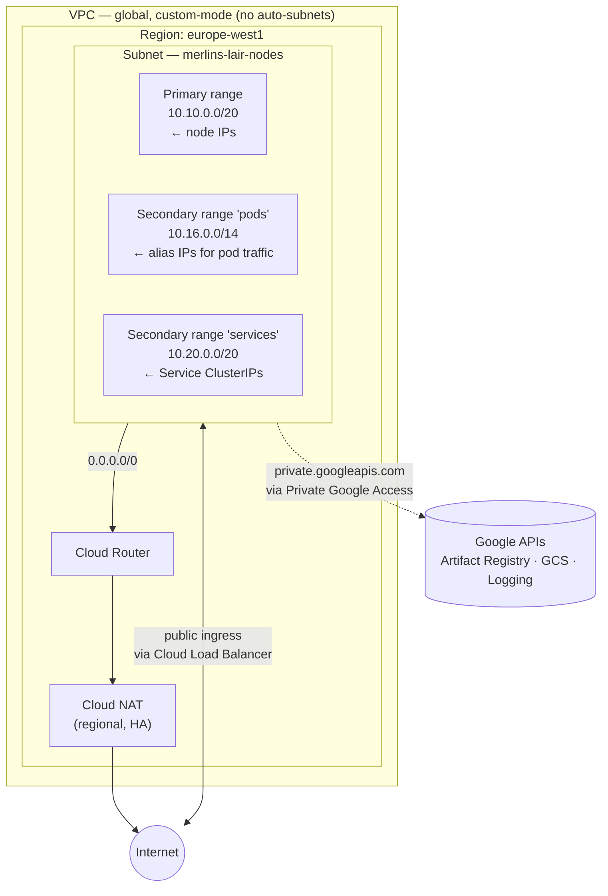
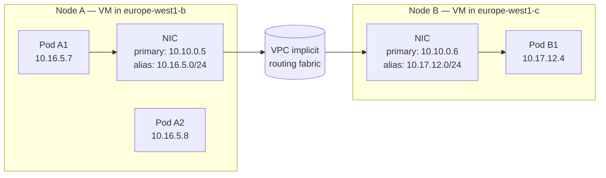
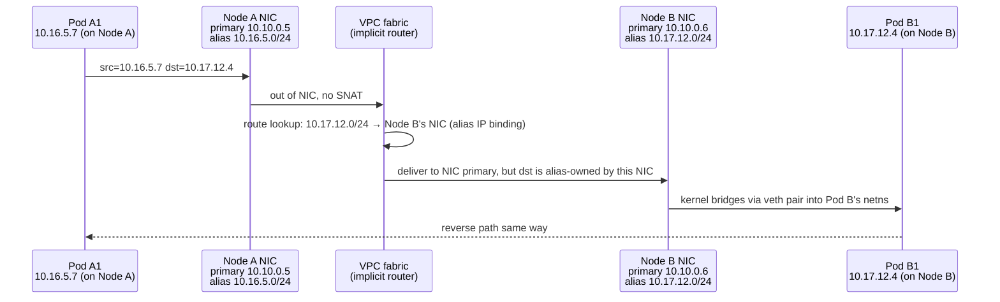
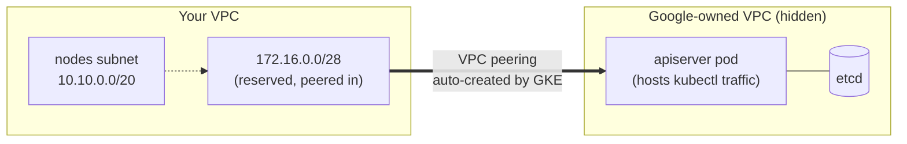
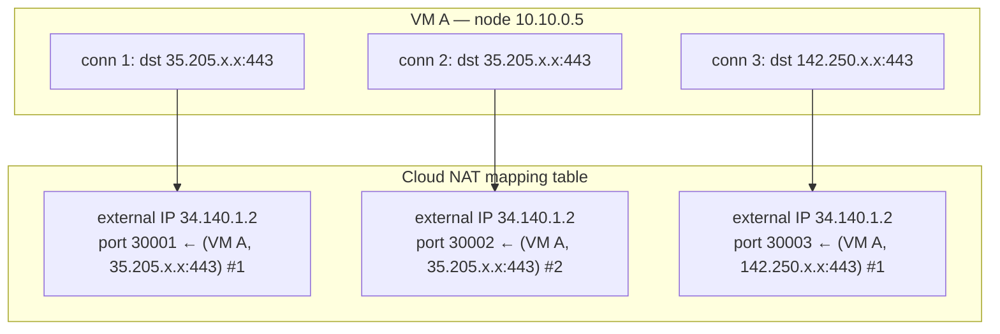

# Day 2 — VPC Networking (GCP)

A learning-oriented walkthrough of the GCP VPC we built. Re-read whenever you forget *why* a piece is there or how it differs from the AWS version.

> **TL;DR.** One custom-mode VPC, one regional subnet in `europe-west1`, with two **secondary ranges** carrying pod and service IPs (VPC-native). Private GKE nodes egress via a single regional **Cloud NAT** anchored on a Cloud Router. Google APIs are reached via **Private Google Access** without going through Cloud NAT. **Cost: ~$32/month**, all of it from Cloud NAT.

---

## Why a VPC at all?

### What a VPC actually is — GCP edition

A VPC ("Virtual Private Cloud") is your software-defined network on GCP. Same idea as AWS: an isolated address space, subnets, routing rules, you control who can talk to what.

But the **mental model is meaningfully different** from AWS. Two properties matter:

1. **GCP VPCs are global.** A single VPC can host subnets in every GCP region simultaneously. Routes between any two subnets are automatic — no peering, no transit gateway needed for the cross-region case. You only get one VPC, used everywhere. (AWS VPCs are regional; cross-region requires peering.)
2. **Subnets are regional.** Each subnet lives in one region but spans **all zones in that region** automatically. There is no "subnet per AZ" pattern. (AWS subnets are per-AZ; you carve one subnet per AZ to get fault isolation.)

This collapses a lot of the AWS day-2 ceremony. Where AWS needed `for_each over data.aws_availability_zones` to produce 3 private + 3 public subnets, GCP needs **one subnet** for the region — zone distribution happens at the VM level.

### Why GKE specifically needs one we control

GKE is "managed Kubernetes," but only the **control plane** is fully managed (apiserver, etcd, scheduler — they run in a Google-managed VPC, not yours). The **data plane** — your nodes and pods — runs in *your* VPC, on Compute Engine VMs you own.

For GKE to work:

1. **Pods get IPs from your VPC.** With **VPC-native** mode (the modern default, what we use), every pod gets a real VPC IP via **alias IPs** on the node's NIC. Pod IPs come from a *secondary range* on your subnet — separate from the node IPs. (More on alias IPs below.)
2. **Routing decides node connectivity.** Private nodes need outbound internet to pull images from `nvcr.io` (Merlin), fetch Helm charts from `*.azurecr.io`, etc. Wrong routing = nodes fail to provision NVIDIA drivers, pods fail with `ImagePullBackOff`.
3. **Google APIs need a route.** Nodes constantly talk to `*.googleapis.com` (Artifact Registry pulls, Cloud Logging writes, GKE control plane peering metadata). With Private Google Access on the subnet, those go over Google's backbone for free; without it, they egress through Cloud NAT and you pay per-GB.
4. **The control plane peers into your VPC.** Private GKE clusters host the apiserver in a hidden Google-owned VPC, which Google auto-peers into yours over a `/28` you assign. Wrong CIDR overlap with your subnets = peering breaks = `kubectl` from inside the VPC fails.

If the VPC is wrong on Day 2, every following day breaks confusingly. Common downstream symptoms when the foundation is off: nodes stuck in `NotReady`, pods in `ImagePullBackOff`, LoadBalancer Services that never get an external IP, `kubectl` from a pod hanging on `*.gke.goog`. Get this right once.

---

## The mental model shift (AWS → GCP)

| Concept | AWS | GCP |
|---|---|---|
| VPC scope | Regional | **Global** |
| Subnet scope | Zonal (per-AZ) | **Regional** (spans all zones) |
| Subnet count for HA cluster | 3 (one per AZ) | **1** (the region IS the unit) |
| Pod IP source | VPC CIDR via VPC CNI | **Secondary range** (alias IPs / VPC-native) |
| Outbound internet | NAT Gateway (one per AZ ideally) | **Cloud NAT** (one per region, HA built-in) |
| Bypass NAT for cloud APIs | VPC Endpoints (Gateway for S3, Interface for STS) | **Private Google Access** (subnet flag) |
| Default firewall posture | Stateful SG, default deny inbound | Stateful firewall rules, **default allow intra-VPC + default deny inbound** |
| Routing across regions | Peering (manual) | **Implicit** within the VPC |

The big "huh, that's nicer" moment is **Cloud NAT**: it's a managed regional service that auto-scales and is HA across zones by default. There is no per-AZ NAT to deploy, no $33/AZ trap, no "single NAT in eu-west-1a is a SPOF."

---

## Big picture



Things to notice in the diagram, vs AWS Day 2:

- **No public/private subnet split.** GCP doesn't model subnets that way — instead, each VM has-or-doesn't-have a public IP, and Cloud NAT covers the ones without.
- **One subnet, three CIDRs.** A single subnet carries node IPs (primary), pod IPs (secondary), and service IPs (secondary). VPC-native makes the latter two visible to the VPC's router so traffic between pods on different nodes is just routed.
- **Cloud Router is upstream of Cloud NAT.** Cloud NAT can't exist without a Cloud Router to anchor it (even though we don't use the router's BGP capability).
- **Google APIs route off-VPC without leaving Google.** Private Google Access is a per-subnet flag that swaps the next-hop for Google API CIDRs.

---

## Components, one by one

### The VPC

#### Why custom-mode (not auto-mode)

GCP gives you two flavours of VPC:

- **Auto-mode VPC.** GCP creates a subnet in *every* region for you, with predefined CIDRs (`10.128.0.0/9` carved up). Convenient for getting started; bad for serious work because you don't own the address plan.
- **Custom-mode VPC.** No subnets created automatically. You define exactly the subnets you want, with the CIDRs you choose.

We use custom-mode because:

1. We want to control which CIDRs are used (for future peering, for non-overlap with the GKE master CIDR `172.16.0.0/28`).
2. We don't need 30+ subnets in regions we don't operate in.
3. The address plan should be intentional, not inherited.

```hcl
resource "google_compute_network" "vpc" {
  name                    = "${var.project}-vpc"
  auto_create_subnetworks = false   # ← custom mode
  routing_mode            = "REGIONAL"
}
```

#### `routing_mode`: REGIONAL vs GLOBAL

This flag decides how Cloud Router (and Cloud Interconnect / VPN, if you used them) advertises VPC subnets via BGP:

- **REGIONAL** (what we picked): each region's Cloud Router advertises only that region's subnets. If you bring on-prem traffic in via Interconnect in `europe-west1`, it can reach `europe-west1` subnets but not `us-central1` subnets unless you also have Interconnect there.
- **GLOBAL**: every Cloud Router advertises every subnet in the VPC, regardless of region. Useful if you want a single Interconnect circuit to reach every region.

For this POC we operate in one region only and don't use BGP at all (Cloud NAT doesn't need it), so REGIONAL is the lower-blast-radius default.

> **Why this exists at all.** Even though you only have one region, the flag is mandatory because GCP's networking layer needs to know whether to make routes "stay-in-region" or "advertised-globally" the moment you ever do bring up Interconnect or VPN. It's a one-line decision now that becomes painful to change once routes are advertised.

---

### The subnet

```hcl
resource "google_compute_subnetwork" "nodes" {
  name          = "${var.project}-nodes"
  network       = google_compute_network.vpc.id
  region        = var.region
  ip_cidr_range = "10.10.0.0/20"   # primary — node IPs

  private_ip_google_access = true

  secondary_ip_range {
    range_name    = "pods"
    ip_cidr_range = "10.16.0.0/14"
  }

  secondary_ip_range {
    range_name    = "services"
    ip_cidr_range = "10.20.0.0/20"
  }
}
```

#### Primary range `10.10.0.0/20`

This is the range from which **node** internal IPs are allocated. `/20` = 4,096 addresses, of which GCP reserves 4 (network, broadcast, default gateway, second-to-last for "future use"). We'll have at most ~4 nodes (1 system + up to 3 GPU), so this is dramatically over-provisioned, and that's fine — IP ranges are free.

We avoided `10.0.0.0/16` deliberately to leave room for future subnets in other regions if we ever expand the VPC.

#### `private_ip_google_access = true`

What it is: a per-subnet boolean.

What it does mechanically: VMs in this subnet can reach Google APIs (`*.googleapis.com`) using their **internal** IPs, without needing a public IP on the VM and without traffic going through Cloud NAT. Google injects routes for the special IPs `199.36.153.4/30` (private.googleapis.com) and `199.36.153.8/30` (restricted.googleapis.com), reachable over Google's backbone.

For our workload this matters a lot:

- **Artifact Registry image pulls** stay on the Google backbone — fast, free, no NAT port consumption.
- **Cloud Logging writes** from every node + pod stay on the Google backbone — same.
- **GKE control plane** metadata calls bypass the public internet.

Turning this off and routing the same traffic through Cloud NAT would cost ~$0.045/GB egress — a 20GB Merlin image pull = ~$0.90 *each cold start*. With it on, that's $0.

There's no AWS equivalent flag — on AWS you achieve the same with **Interface VPC Endpoints** for individual services (one per service, hourly fee each), or **Gateway endpoints** for S3/DynamoDB only. Private Google Access is a single subnet flag covering all of `*.googleapis.com`.

---

### Secondary ranges and VPC-native (alias IPs)

This is the most foreign GCP-specific concept. Worth understanding properly because it's the source of all pod-to-pod routing on GKE.

#### What an alias IP actually is

When a Compute Engine VM boots in a subnet that has secondary ranges, GCP can allocate the VM **a slice of the secondary range** and bind it to the VM's primary NIC as **alias IPs** (separate from the VM's primary IP).

Concretely: a GKE node booting in our subnet gets:

- One primary IP from `10.10.0.0/20` (node IP, used for SSH, kubelet, etc.)
- One `/24` slice from `10.16.0.0/14` (pods range), e.g. `10.16.5.0/24` — bound as alias IPs to the same NIC. **Every pod on this node gets an IP from this /24.**

Pod IPs are real, routable VPC addresses. A pod on Node A talking to a pod on Node B sends a packet from `10.16.5.7` to `10.17.12.4`, the VPC router knows Node B owns `10.17.12.0/24` (because of the alias IP binding), and routes the packet to Node B's NIC. Node B's kernel then forwards to the pod's veth.



Compare to **kubenet** (the old, non-VPC-native GKE mode): pod IPs live on a per-node overlay; VPC routes between pod CIDRs are programmed by GKE into a custom routes table. Slower, less scalable, deprecated. We use VPC-native everywhere.

#### Why two secondary ranges (pods + services)

Kubernetes has two flat IP namespaces:

- **Pod IPs**: every pod gets one, used for pod-to-pod traffic.
- **Service ClusterIPs**: every Service gets one, used as a stable virtual IP that kube-proxy DNATs to actual pod IPs.

GKE's VPC-native model wants both backed by VPC ranges. The pod range becomes alias IPs; the service range is *not* aliased onto NICs but lives only in iptables/ipvs rules on each node — Service traffic never leaves the node-local kernel until it's already been DNAT'd to a pod IP.

Splitting them into two secondary ranges keeps the address planning explicit. You can resize each independently.

#### Sizing decisions

- **Pods range `/14` = ~262k addresses.** GKE allocates **one `/24` per node** by default. /14 / /24 = 1,024 nodes. Massive overkill for a POC, but the cost is zero and the alternative (small range → cap on max nodes) is hard to fix later.
- **Services range `/20` = 4,096.** ClusterIPs are cheap and small numbers are common; /20 is fine.
- **Node range `/20` = 4,096.** Will never hit even 1% of this.

> **Footgun.** GKE secondary range sizing is *fixed at cluster creation*. Resizing the pods range requires recreating the cluster. Sizing generously now is cheap insurance.

---

### Cloud Router

```hcl
resource "google_compute_router" "router" {
  name    = "${var.project}-router"
  region  = var.region
  network = google_compute_network.vpc.id
}
```

#### What Cloud Router actually is

Cloud Router is GCP's managed BGP speaker. It can:

- exchange routes with on-prem routers via Cloud VPN (HA VPN) or Cloud Interconnect
- advertise dynamic routes for VPC subnets to those external peers
- **anchor Cloud NAT configurations** (this is the only thing we use it for)

We don't run BGP. We have no on-prem. The Cloud Router exists *only because Cloud NAT requires a Cloud Router resource as its parent*. It costs nothing on its own; it's a configuration-holder. Think of it as the metadata anchor that Cloud NAT attaches to.

> **Why GCP did it this way.** Cloud Router predates Cloud NAT. When Cloud NAT shipped, rather than introducing a new top-level resource, Google modeled NAT as a feature of an existing router. Vestigial-feeling but consistent with the rest of the gateway model.

---

### Cloud NAT

```hcl
resource "google_compute_router_nat" "nat" {
  name                               = "${var.project}-nat"
  router                             = google_compute_router.router.name
  region                             = var.region
  nat_ip_allocate_option             = "AUTO_ONLY"
  source_subnetwork_ip_ranges_to_nat = "ALL_SUBNETWORKS_ALL_IP_RANGES"

  log_config {
    enable = false
    filter = "ERRORS_ONLY"
  }
}
```

#### What Cloud NAT actually is

Cloud NAT is a **regional, fully-managed, HA network address translation service**. It is not a VM, not an appliance, not a fixed-bandwidth device. It runs as a horizontally-scaled service inside Google's networking fabric.

When a VM with no public IP sends a packet to `0.0.0.0/0`, GCP's networking layer:

1. Identifies that the source subnet is opted into NAT (via `source_subnetwork_ip_ranges_to_nat`).
2. Picks an external IP from the NAT's IP pool (auto-allocated for `AUTO_ONLY`).
3. Allocates a port on that IP for this connection.
4. Rewrites the packet's source to `(external IP, port)`, sends it.
5. On reverse traffic, looks up the mapping and rewrites back.

The reason it's HA without configuration: there is no single NAT VM to fail. Compare to AWS, where a NAT Gateway is "regional" but actually deployed in *one* AZ — you get one NAT GW per AZ for true HA, paying $33/mo each.

#### `nat_ip_allocate_option = AUTO_ONLY`

Two options:

- **AUTO_ONLY**: GCP automatically allocates external IPs as the NAT scales up port usage. Good for variable workloads.
- **MANUAL_ONLY**: you reserve specific external IPs (`google_compute_address`) and bind them. Use this when you need a fixed source IP for outbound (e.g. third-party API allowlists).

For a POC with no allowlist requirements, `AUTO_ONLY` is right.

#### `source_subnetwork_ip_ranges_to_nat = ALL_SUBNETWORKS_ALL_IP_RANGES`

This says: NAT every IP from every subnet in the region — primary ranges *and* secondary ranges. Critically the second part: **without this, pod IPs (which come from secondary ranges) wouldn't be NAT'd**, and pod-originated egress to the internet would silently drop.

The narrower options exist (`LIST_OF_SUBNETWORKS`, `ALL_SUBNETWORKS_ALL_PRIMARY_IP_RANGES`) for cases where you want fine-grained control. For our single-subnet POC the broad option is correct.

#### Port allocation (the silent footgun)

Each NAT'd VM gets a default of **64 source ports** for outbound connections. That's fine for ~64 simultaneous connections to the *same destination IP+port* — Cloud NAT's port table is keyed on `(VM, dest IP, dest port)`, so 64 ports per (vm, dest) tuple.

Where it bites: a worker pod streaming to a single Google API endpoint with a connection pool of 100 will exhaust ports and start failing with `connection refused` *only after the pool fills*. Symptoms are intermittent, not deterministic.

Mitigations if we ever hit this:
- `min_ports_per_vm = 2048` on the NAT (raises the floor)
- `enable_dynamic_port_allocation = true` (lets NAT grow ports per VM under pressure)
- Use a managed instance group with multiple VMs (parallelism)

For our 1-system-node + scale-to-zero-GPU POC we won't come close.

#### `log_config`

Cloud NAT can log every NAT translation. Useful for debugging, *expensive at scale*. We disable. If something is mysteriously dropping outbound, flip `enable = true, filter = "ERRORS_ONLY"` temporarily.

---

## Behind the scenes

### How alias IPs make pod-to-pod routing "just work"

The key insight: with VPC-native, **the VPC's internal router knows which node owns which pod /24**. There's no overlay, no encapsulation, no GKE-managed routes table.

Walkthrough of a pod-to-pod packet:



Notice what's *not* there: no VXLAN, no IP-in-IP, no GKE-managed Compute Engine routes. The alias IP binding on the NIC is itself the route hint the VPC fabric uses.

### How the GKE control plane reaches into your VPC (private clusters)

Today the cluster is a **private cluster** (`enable_private_nodes = true`). That means:

- Nodes have no public IPs.
- The cluster's apiserver is hosted by Google in a Google-owned VPC.
- Google peers that hidden VPC into yours via an automatically-created VPC peering, exposing a `/28` of internal IPs to your VPC. We assigned that `/28` to be `172.16.0.0/28`.



The *requirement* this places on your VPC: `master_ipv4_cidr_block` (we set `172.16.0.0/28`) must not overlap with **any** subnet primary or secondary range, **including future ones**. Hence why we used 10.x for our subnets and 172.16.x for the master CIDR — they're in distant RFC 1918 blocks.

When kubectl from a pod (e.g. KEDA) calls the apiserver, the request:

1. Goes from pod → node alias IP → VPC fabric → peered `/28` → Google's hidden VPC → apiserver.
2. From your laptop (kubectl): goes from laptop → public internet → GKE public endpoint → master_authorized_networks check → apiserver (same one).

Two paths to the same control plane. (We'll dig into this in `03-gke.md`.)

### Cloud NAT's port allocation, visualized



Each entry consumes one port from the VM's allocated pool. Defaults: 64 ports per VM. When the pool fills, new connections are dropped (not queued) — this is the silent failure mode worth knowing about even if you never trip it.

---

## What we deliberately skipped

- **Shared VPC.** A pattern where one host project owns the VPC and other service projects attach. Right approach for multi-team orgs. Overkill for a one-person POC.
- **VPC Service Controls.** Data perimeter, prevents exfil to outside-perimeter Google services. Appropriate when you handle regulated data; nothing here qualifies.
- **Multi-region subnets.** We have one subnet. Adding more is one resource block away and changes nothing else.
- **HA VPN / Cloud Interconnect.** No on-prem network to peer with.
- **Custom firewall rules.** GCP's default firewall rules already allow intra-VPC traffic and deny inbound from the internet — sufficient for now. We'll add explicit rules later for the LoadBalancer Service health checks (Day 9).
- **Private Service Connect (PSC).** PSC is the modern way to expose services privately across VPCs. We don't expose anything.

---

## Cost meter

| Component | Cost |
|---|---|
| VPC, subnet, Cloud Router | $0 |
| Cloud NAT | ~$0.044/hr ≈ **$32/month** + $0.045/GB processed |
| Private Google Access | $0 |
| Egress to internet (via Cloud NAT) | $0.12/GB to most destinations (after free tier) |
| Egress to Google APIs (via PGA) | $0 |
| Cross-zone traffic | $0.01/GB (same region, between zones) — relevant if pods on different zones |

**Compare to AWS Day 2:**
- AWS NAT GW: $33/mo + $0.045/GB processed → roughly equivalent
- AWS S3 Gateway endpoint: $0 (matches PGA for one specific service)
- AWS interface endpoints (per-service): $0.01/hr each + $0.01/GB → would replace PGA partially, but at extra cost

Net for Day 2: **~$32/mo with daily teardown**, dominated by Cloud NAT just like AWS was dominated by NAT GW. Can't get this lower without losing private nodes.

---

## Verification

After `make up` completes (Day 3, since GKE is what makes the network testable):

```bash
# 1. The VPC, subnet, NAT exist
gcloud compute networks describe merlins-lair-vpc
gcloud compute networks subnets describe merlins-lair-nodes --region=europe-west1
gcloud compute routers nats describe merlins-lair-nat --router=merlins-lair-router --region=europe-west1

# 2. The subnet's secondary ranges are present
gcloud compute networks subnets describe merlins-lair-nodes --region=europe-west1 \
  --format='value(secondaryIpRanges[].rangeName,secondaryIpRanges[].ipCidrRange)'

# 3. PGA is enabled
gcloud compute networks subnets describe merlins-lair-nodes --region=europe-west1 \
  --format='value(privateIpGoogleAccess)'
# → True

# 4. Once GKE is up: pod IPs are coming from the pods range
kubectl get pods -A -o custom-columns='NAME:.metadata.name,IP:.status.podIP'
# → IPs should be in 10.16.0.0/14

# 5. Confirm a node has an alias IP range bound
gcloud compute instances describe <node-name> --zone=europe-west1-b \
  --format='value(networkInterfaces[].aliasIpRanges[].ipCidrRange)'
# → e.g. 10.16.5.0/24
```

---

## Recap, in one paragraph

We built **one custom-mode global VPC**, with **one regional subnet** carrying three CIDRs (nodes, pods, services). Outbound to the internet goes through a **single regional Cloud NAT** anchored on a Cloud Router; outbound to Google APIs (Artifact Registry, Logging, Monitoring) bypasses NAT via **Private Google Access** for free. The GKE control plane will peer into the VPC via a `/28` we reserved at `172.16.0.0/28`, kept far from our `10.x` ranges to avoid overlap. Pod-to-pod traffic is **VPC-native** — pod IPs are real alias IPs on node NICs, routed by the VPC fabric with no overlay. Cost is ~$32/month, all from Cloud NAT, mirrored to the AWS NAT Gateway charge.
