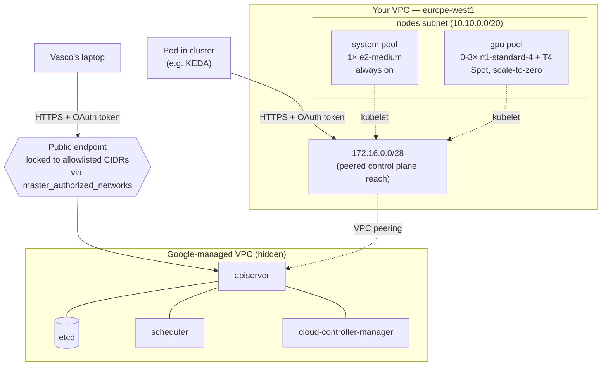
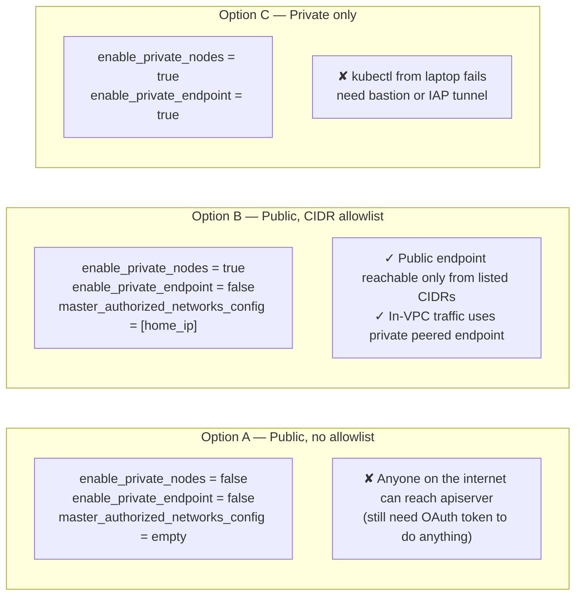
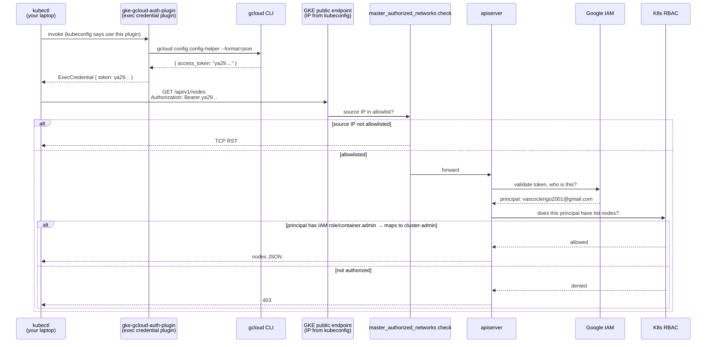
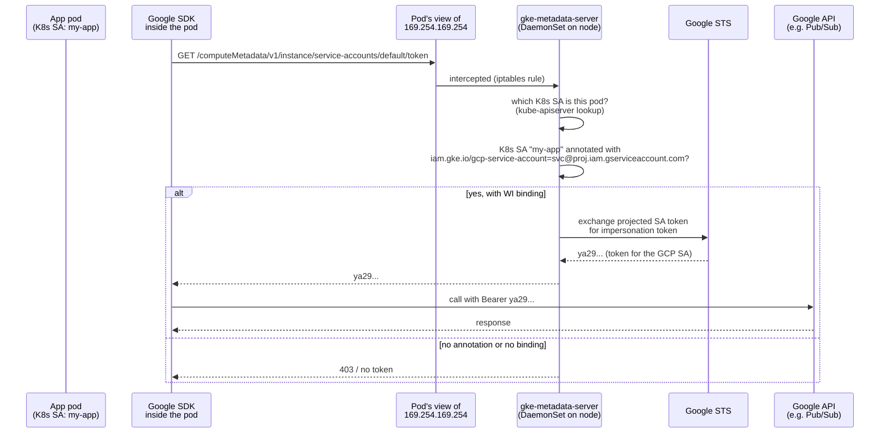
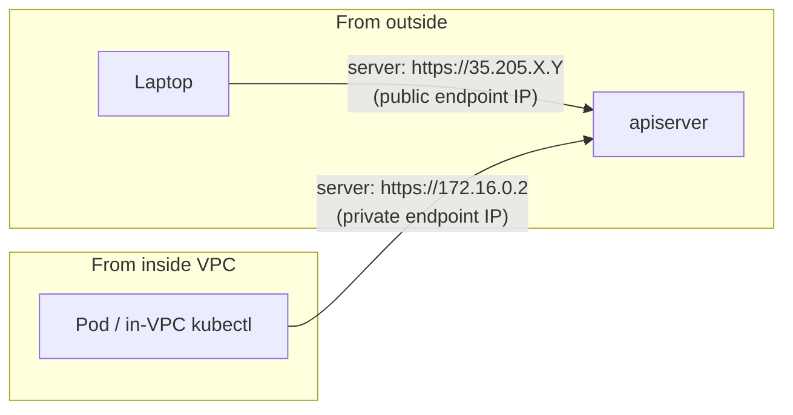
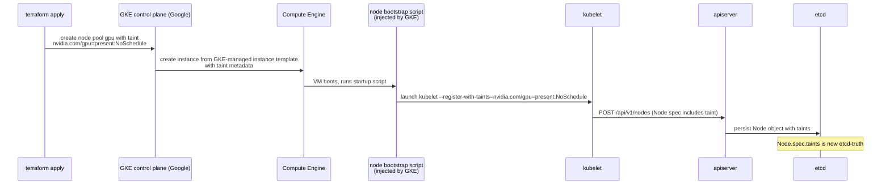

# Day 3 — GKE Cluster + Node Pools

A learning-oriented walkthrough of the GKE cluster we built. Re-read whenever you forget *why* a knob is set the way it is, or when you want to compare a behavior to its EKS counterpart in `aws/docs/03-eks.md`.

> **TL;DR.** A **zonal**, **private** GKE Standard cluster running Kubernetes 1.30 on the REGULAR release channel. Two node pools: a 1-node `system` pool on `e2-medium` (always on) and a 0-3-node `gpu` pool on `n1-standard-4 + nvidia-tesla-t4` Spot (scale-to-zero). Control plane endpoint is reachable both privately (over auto-peered VPC) and publicly (locked to allowlisted CIDRs). Pod-to-cloud auth is wired via **Workload Identity** at the cluster level. **Cost: ~$0.20/hr running, ~$20/month with daily `make down` discipline.**

---

## What GKE is

### Control plane vs data plane (same story, different cloud)

GKE is "managed Kubernetes." Google operates the **control plane** — apiserver, etcd, scheduler, controller-manager, the whole apparatus. You operate the **data plane** — node VMs, pods, your workloads.

Where it differs from EKS:

| | EKS | GKE |
|---|---|---|
| Control plane VPC | AWS-owned, ENIs injected into your VPC | Google-owned, **VPC-peered** into your VPC for private clusters |
| Connection from inside VPC | DNS split-horizon resolves to private ENI IPs | Direct routing to peered `/28`, no DNS magic |
| Connection from laptop | Same FQDN, public AWS edge IP | Different endpoint IP from kubeconfig (public OR private) |
| Hourly fee | $0.10/hr | $0.10/hr |
| Free first cluster | No | **Yes (Autopilot only)** |

The mental model: instead of AWS's "we plug ENIs into your subnets and use split-horizon DNS so kubectl from inside or outside resolves to the right thing," Google's model is "we run the control plane in a hidden VPC and **peer** that VPC into yours, so internal traffic just routes there." You pay a `/28` of address space; you don't manage any ENIs.

---

## Big picture



What to notice:

- **Two paths to the same apiserver.** Public (laptop) and private (in-VPC), via different IPs. Not the same FQDN-with-different-resolution like EKS — these are genuinely different addresses.
- **The `/28` is the gateway.** The `master_ipv4_cidr_block` we reserved on Day 2 is what makes private access possible. Pods, kubelets, and any in-VPC kubectl all reach the apiserver via this peered range.
- **Node pools live in your subnet.** Both pools are in the same subnet, separated only by labels and taints.

---

## API endpoint access modes

GKE gives you a matrix of public-or-private × restricted-or-not:



We chose **Option B** (analogous to AWS Day 3's choice of public+private+allowlist):

```hcl
private_cluster_config {
  enable_private_nodes    = true   # nodes have no public IPs
  enable_private_endpoint = false  # public control plane endpoint exists
  master_ipv4_cidr_block  = local.master_cidr
}

master_authorized_networks_config {
  dynamic "cidr_blocks" {
    for_each = var.api_allowed_cidrs   # set in terraform.tfvars (gitignored)
    content {
      cidr_block   = cidr_blocks.value
      display_name = "allowlisted"
    }
  }
}
```

Why this combo:

- **Private nodes**: nodes don't get public IPs, so there's no "we accidentally exposed an SSH on the internet" risk. Outbound goes through Cloud NAT.
- **Public control plane endpoint**: you can `kubectl` from your laptop without setting up a bastion or IAP tunnel.
- **Allowlist on the public endpoint**: only your home IP can hit the apiserver from outside, so the public endpoint is much closer to "private with one specific exception."

> **AWS contrast.** EKS achieves the same end state with `cluster_endpoint_public_access_cidrs`, but the wire-level mechanism is split-horizon DNS: same FQDN, different resolution depending on resolver. GKE doesn't bother with DNS — the public IP and private IP are simply different endpoints, and your kubeconfig points at one of them based on how `gcloud get-credentials` was invoked. Conceptually simpler.

---

## Cluster auth — GCP IAM + Kubernetes RBAC

This is the section with the biggest deviation from EKS. There is **no Access Entries equivalent** on GKE because GKE wires GCP IAM directly into the apiserver.

### How `kubectl get nodes` from your laptop actually works



Key components:

- **`gke-gcloud-auth-plugin`** — the kubectl exec credential plugin. Equivalent of `aws eks get-token`. Installed alongside gcloud, called by kubectl.
- **OAuth access token** — short-lived (~1hr), bearer token issued by Google IAM. Equivalent of the presigned STS URL EKS uses.
- **No static credentials in kubeconfig.** Same hygiene as AWS — the kubeconfig is committable in principle, all secrets live in your gcloud session.

### IAM-to-RBAC mapping

GKE has **two layers of authorization**:

1. **GCP IAM at the project / cluster level.** Roles like `roles/container.admin`, `roles/container.developer`, `roles/container.viewer`. These grant API permissions on the GKE *resource* (e.g. "can call `getCredentials`") and pre-baked Kubernetes RBAC mappings (`roles/container.admin` maps to `cluster-admin`).
2. **Kubernetes RBAC inside the cluster.** Standard `Role`/`ClusterRole` + `RoleBinding`/`ClusterRoleBinding`. You can bind to GCP identities directly: `subjects: [{kind: User, name: vascoclerigo2001@gmail.com}]`.

Today the IAM principal that ran `terraform apply` is automatically wired up — the project owner has `roles/owner` which inherits cluster-admin. No equivalent of `enable_cluster_creator_admin_permissions` needed; it's implicit.

### What replaces Access Entries

Nothing; the model just doesn't need them. To grant a teammate kubectl access:

1. Grant them `roles/container.developer` (or more) on the project: `gcloud projects add-iam-policy-binding`.
2. They run `gcloud container clusters get-credentials`.
3. Done.

No ConfigMap to edit, no Access Entry resource to manage. The trade-off is that you lose the EKS-style "user X is mapped to K8s group Y, group Y has these RBAC bindings" flexibility — instead, IAM roles map to fixed K8s groups (e.g. `roles/container.admin` → `system:masters`).

---

## Node pools

### System pool

```hcl
resource "google_container_node_pool" "system" {
  name       = "system"
  cluster    = google_container_cluster.primary.id
  location   = var.zone
  node_count = 1

  node_config {
    machine_type = "e2-medium"
    disk_size_gb = 30
    workload_metadata_config { mode = "GKE_METADATA" }
    oauth_scopes = ["https://www.googleapis.com/auth/cloud-platform"]
  }

  management { auto_repair = true; auto_upgrade = true }
}
```

**Why `e2-medium`.** Cheapest GCP machine type that runs kube-system + a small KEDA + a small Cluster Autoscaler controller without thrashing. ~$24/mo on-demand. Equivalent to t3.medium on AWS.

**Why one node, not three.** Same call as the AWS plan: at POC scale, a single system node is enough. If it dies, GKE replaces it (auto-repair). No HA, but the control plane is what would page you anyway, and that's HA whether you have 1 or 3 nodes.

**`workload_metadata_config { mode = "GKE_METADATA" }`.** This enables the **GKE Metadata Server** on the node — a DaemonSet (`gke-metadata-server`) that intercepts pod calls to `169.254.169.254`. **This is the linchpin of Workload Identity.** Without it, WI doesn't work for pods on this pool. We set it on every node pool that runs workloads needing GCP API access.

**`oauth_scopes`.** Compute Engine VMs traditionally got their permissions via per-VM OAuth scopes ("this VM can call Compute Engine API but not BigQuery"). With Workload Identity, that model is mostly bypassed — pod permissions come from the bound GCP SA, not the node SA. We set the broad `cloud-platform` scope so the node itself can pull from Artifact Registry, write logs, etc., and let WI restrict per-pod access.

### GPU pool

```hcl
resource "google_container_node_pool" "gpu" {
  name               = "gpu"
  cluster            = google_container_cluster.primary.id
  location           = var.zone
  initial_node_count = 0

  autoscaling {
    min_node_count = 0
    max_node_count = 3
  }

  node_config {
    machine_type = "n1-standard-4"
    spot         = true
    disk_size_gb = 50

    guest_accelerator {
      type  = "nvidia-tesla-t4"
      count = 1
      gpu_driver_installation_config { gpu_driver_version = "DEFAULT" }
    }

    taint {
      key    = "nvidia.com/gpu"
      value  = "present"
      effect = "NO_SCHEDULE"
    }

    labels = { "nvidia.com/gpu" = "true" }

    workload_metadata_config { mode = "GKE_METADATA" }
    oauth_scopes = ["https://www.googleapis.com/auth/cloud-platform"]
  }

  management { auto_repair = true; auto_upgrade = true }
}
```

**Why `n1-standard-4` not the newer N2/E2.** T4 GPUs only attach to N1 instance families. If we wanted L4 we'd use G2 (`g2-standard-4`); if A100, A2; if H100, A3. T4 on N1 is the cheapest option and all we need.

**`spot = true`.** GCP Spot VMs are equivalent to AWS Spot — preemptible, can be reclaimed with 30s notice, ~70% cheaper than on-demand. The 24-hour max-lifetime that older "preemptible VMs" had is gone on Spot.

**`gpu_driver_installation_config { gpu_driver_version = "DEFAULT" }`.** This is the magic line. GKE auto-installs the matching NVIDIA driver via a managed DaemonSet on this pool. **No nvidia-device-plugin DaemonSet to install via Helm later** (vs AWS Day 6 which Helm-installs the device plugin). One config line replaces a chart.

**Taint and label.** Same pattern as the AWS GPU node group: pods that don't tolerate `nvidia.com/gpu=present:NoSchedule` won't land here, and the label lets nodeSelector-based pinning work. *GKE auto-applies this taint* when `guest_accelerator` is set — we declare it explicitly anyway for parity with the AWS code and to surface intent in the Terraform.

**`initial_node_count = 0` + autoscaler.** Pool starts empty. GKE's built-in Cluster Autoscaler scales it up when a Pending pod requests a GPU resource that fits this pool, scales down when the pod terminates. No separate Helm install for Cluster Autoscaler (vs AWS Day 6 which Helm-installs the autoscaler). It's part of GKE.

---

## Workload Identity — the IRSA replacement

This deserves its own section because it's the biggest cognitive shift from AWS.

### What problem it solves

A pod running in GKE wants to call a Google API (e.g. publish to a Pub/Sub topic). It needs short-lived OAuth tokens scoped to a GCP identity. We do **not** want to:

- bake a service account JSON key into the image (key sprawl, no rotation),
- mount it as a Secret (same problem, slightly less obvious),
- give the *node* broad permissions and let any pod do anything (over-privileged blast radius).

Workload Identity = "bind a Kubernetes ServiceAccount to a Google ServiceAccount, so pods running as that K8s SA get tokens for that GCP SA, automatically and short-lived."

### How it works mechanically



Three pieces are required for this to work:

1. **Cluster-level WI on.** `workload_identity_config.workload_pool = "<project>.svc.id.goog"`. We set this in `gke.tf`.
2. **Node-pool-level metadata server on.** `workload_metadata_config { mode = "GKE_METADATA" }` per pool. Without it, the metadata server isn't intercepting on those nodes and pods get the *node's* identity.
3. **Per-workload binding** (Day 6):
   - `google_service_account` for the workload (e.g. `merlins-lair-app-sa`).
   - `google_project_iam_member` granting it the actual GCP roles (e.g. `roles/pubsub.publisher`).
   - `google_service_account_iam_member` with role `roles/iam.workloadIdentityUser`, member `serviceAccount:<project>.svc.id.goog[<ns>/<k8s-sa>]`. This is the binding.
   - K8s ServiceAccount annotated with `iam.gke.io/gcp-service-account=merlins-lair-app-sa@<proj>.iam.gserviceaccount.com`.

### vs IRSA

| | IRSA (AWS) | Workload Identity (GCP) |
|---|---|---|
| Cluster-level setup | OIDC provider resource (`aws_iam_openid_connect_provider`), thumbprints, issuer URL | One config block (`workload_pool = "<project>.svc.id.goog"`) |
| Node-level setup | None | DaemonSet enabled per pool (`GKE_METADATA`) |
| Binding direction | IAM Role's trust policy mentions K8s SA | Both: GCP SA grants `iam.workloadIdentityUser` to K8s SA, AND K8s SA annotated with GCP SA email |
| Pod-side detection | AWS SDK reads `AWS_WEB_IDENTITY_TOKEN_FILE`, `AWS_ROLE_ARN` env vars | Google SDK calls metadata server (no special env vars needed) |
| Visibility on first wire-up | "Why are my creds 403?" — usually OIDC thumbprint or role trust policy | "Why are my creds 403?" — usually missing annotation, missing IAM binding, or wrong namespace |

The IRSA setup has **more parts but they're all explicit**; the WI setup has **fewer parts but failures are more spread out** (wrong annotation? wrong IAM binding? metadata server off on this pool?).

---

## What we deliberately skipped

- **GKE Autopilot.** Lets Google manage everything (node pools, scaling, security defaults), pay per-pod. Tempting but GPU support has constraints (specific machine families, restrictions on Spot for some GPUs) and we want raw control over the GPU pool for KEDA testing.
- **Regional cluster.** Spreads the control plane across 3 zones for HA. Same $0.10/hr fee as zonal. We picked zonal for simplicity (mirrors the AWS "one AZ" POC pattern). Worth flipping for production.
- **GKE Enterprise / Anthos.** Multi-cluster management, fleet, config sync. Out of scope for one-cluster POC.
- **Customer-Managed Encryption Keys (CMEK).** Encrypting etcd with our own KMS key. AWS Day 3 also skipped this (`create_kms_key = false`). Same trade-off — small cost saving, weaker compliance posture.
- **Binary Authorization.** Policy that only signed images can run. Worth wiring later for the AR push pipeline.
- **Network Policies.** GKE supports Calico-based or GKE Dataplane V2 network policies. We don't define any policies yet — every pod can reach every other pod. Will revisit when we have multiple services.

---

## Cost meter

| Component | Running cost | Notes |
|---|---|---|
| GKE control plane fee | $0.10/hr ($73/mo) | Same as EKS |
| 1× e2-medium (system pool) | $0.0335/hr (~$24/mo) | Cheaper than t3.medium |
| Cloud NAT (from Day 2) | $0.044/hr (~$32/mo) | + per-GB |
| GPU pool at desired=0 | **$0** | Scale-to-zero |
| GPU pool when 1× n1-standard-4 + T4 Spot is up | ~$0.18/hr | Only during testing |
| Persistent disks (pd-balanced default) | trivial | ~30-50GB per node |

**Stack-up rate (no GPU): ~$0.18/hr → $4.30/day if left on, ~$130/mo if 24/7.**
**With daily `make down` discipline and 3-4 hr sessions: ~$0.60-0.80/day → ~$20/mo.**

GPU sessions add ~$0.18/hr each. Three 1-hour testing sessions per week = ~$2/mo extra.

Compare AWS Day 3:
- EKS: $0.10/hr fee, 1× t3.medium $0.0416/hr, NAT GW $0.045/hr — total ~$0.19/hr
- GKE: $0.10/hr fee, 1× e2-medium $0.0335/hr, Cloud NAT $0.044/hr — total ~$0.18/hr

Effectively a wash on baseline. The win on GCP is **no Free Plan trap** + **no Helm install for the device plugin or autoscaler** (less complexity = less cost in time).

---

## `make up` / `make down` — the daily ritual

The `gcp/Makefile` mirrors the AWS one but with `gcloud` instead of `aws eks`:

```bash
make up      # terraform apply + gcloud get-credentials + kubectl get nodes
make down    # terraform destroy
make status  # cluster status (works even when down)
make ip      # current public IP — paste into terraform.tfvars if home IP changed
make plan    # terraform plan
```

`terraform.tfvars` is gitignored. `terraform.tfvars.example` shows the shape. If your home IP changes, `make ip` then update tfvars then `make apply`.

> **One-time setup.** Before the first `make up` you must:
> 1. `gcloud auth login` (interactive, opens browser)
> 2. `gcloud auth application-default login` (this sets up Application Default Credentials, what Terraform uses)
> 3. Create the GCS state bucket manually (Day 1)
> 4. `terraform init` in `gcp/terraform/`
> The `make auth` target wraps the first two.

---

## Verification

After `make up` completes:

```bash
# 1. Cluster is RUNNING
gcloud container clusters describe merlins-lair-gke --zone=europe-west1-b \
  --format='value(status)'
# → RUNNING

# 2. Master authorized networks include your home IP
gcloud container clusters describe merlins-lair-gke --zone=europe-west1-b \
  --format='value(masterAuthorizedNetworksConfig.cidrBlocks)'
# → [{cidrBlock: 193.5.x.x/32, displayName: allowlisted}]

# 3. System node Ready, GPU pool empty
kubectl get nodes -o wide
# → 1 node Ready, no nvidia.com/gpu node visible

# 4. kube-system pods Running
kubectl get pods -n kube-system
# → coredns x2, fluentbit-gke (Cloud Logging agent), gke-metadata-server, kube-proxy, etc.

# 5. Workload Identity is on at the cluster
gcloud container clusters describe merlins-lair-gke --zone=europe-west1-b \
  --format='value(workloadIdentityConfig.workloadPool)'
# → <project-id>.svc.id.goog

# 6. GPU node pool exists at size 0 with autoscaler enabled
gcloud container node-pools describe gpu --cluster=merlins-lair-gke --zone=europe-west1-b \
  --format='value(autoscaling)'
# → enabled=True, minNodeCount=0, maxNodeCount=3

# 7. Smoke-test Spot GPU provisioning (manually scale to 1, verify driver, scale back)
gcloud container clusters resize merlins-lair-gke --node-pool=gpu --num-nodes=1 \
  --zone=europe-west1-b --quiet
# wait ~5 min for node + driver
kubectl get nodes -l nvidia.com/gpu=true -o wide
gcloud container clusters resize merlins-lair-gke --node-pool=gpu --num-nodes=0 \
  --zone=europe-west1-b --quiet
```

---

## Behind the scenes

### Where cluster state lives — and who can change it

The cluster state model is **identical to EKS** — it's vanilla Kubernetes underneath:

- `etcd` is the source of truth for everything: Pods, Services, Nodes, ConfigMaps, your CRDs, the lot.
- The `apiserver` is the only thing that talks to etcd. Every read/write goes through it.
- "Control plane" = `apiserver` + `etcd` + `scheduler` + `controller-manager` + `cloud-controller-manager`. Google manages all of these. You never see them — there are no kube-system pods named `kube-apiserver-*` like you'd see on a kubeadm cluster.
- "Cluster state" = the contents of etcd. You modify it freely via `kubectl apply` / Terraform / Helm — that's the *whole point* of having a Kubernetes cluster.

| Object field | Who writes it | Notes |
|---|---|---|
| `Node.spec.taints` | kubelet on initial registration; you can patch later | GKE node-pool config feeds the kubelet's `--register-with-taints` |
| `Node.spec.providerID` | cloud-controller-manager (Google's, in their VPC) | Includes the GCE VM URL |
| `Node.status.*` | kubelet (heartbeats) | nodeInfo, conditions, etc. |
| `Node.metadata.labels["nvidia.com/gpu"]` | kubelet, from node-pool config | Node-pool labels become node labels |
| `Pod.status.podIP` | kubelet, after CNI assigns alias IP | We're on GKE Dataplane V2 / Calico-based CNI by default |

### How the same cluster has two different endpoints (no DNS magic)

This is genuinely simpler than the EKS split-horizon model.



GKE provisions **two** endpoint IPs for a public+private cluster:

- A **public IP** that's reachable from the internet (subject to `master_authorized_networks`).
- A **private IP** inside the peered `/28` (e.g. `172.16.0.2`) that's reachable from within the VPC.

Your kubeconfig has *one* `server:` URL — whichever one `gcloud container clusters get-credentials` chose:

- Default: public endpoint → `server: https://<public-ip>`
- With `--internal-ip` flag: private endpoint → `server: https://<private-ip>`

There is **no FQDN that resolves differently inside vs outside the VPC.** You pick the address up-front and bake it into your kubeconfig. If you want to flip, regenerate the kubeconfig with the other flag.

> **What if we wanted a bastion?** On GCP the more common pattern is **IAP Tunneling** — `gcloud compute ssh` over Identity-Aware Proxy, which gives an authenticated TCP tunnel to a private VM without needing public IPs or VPN. For kubectl, you'd typically run `gcloud container clusters get-credentials --internal-ip` from a small bastion VM that you reach via IAP. Slightly different from AWS's bastion-in-a-public-subnet pattern.

### How a "GKE-managed taint" actually works under the hood

Same fundamental story as EKS-managed: the taint is configured at the cloud-API level, but it physically materializes on the Node object via the kubelet's bootstrap.



Three takeaways:

1. The taint is **per-pool** in the GKE config but **per-node** in etcd. All nodes from this pool get the same taint at registration.
2. **GKE auto-applies `nvidia.com/gpu=present:NoSchedule` whenever `guest_accelerator` is set on a pool.** We declare it explicitly anyway because explicit code is easier to reason about than magic.
3. A pool config change to taints is **only effective on new nodes**. Existing nodes keep their old taints until replaced (rolling upgrade or manual recreation).

#### Three ways to taint manually (mirroring the AWS doc)

GKE doesn't have "self-managed node pools" as a separate concept the way EKS does — every node pool is GKE-managed. But the underlying object is still a Kubernetes Node, so:

1. **`kubectl taint node <node> key=value:effect`** — direct write to `Node.spec.taints` via the apiserver. Survives until the node is removed. Will be re-applied by GKE on the next pool sync if it conflicts with the pool config.
2. **Edit pool config and recreate nodes.** `gcloud container node-pools update --node-taints=...` then trigger a rolling recreation. New nodes come up with new taints; old ones aren't modified.
3. **Direct API curl.** Same as EKS — `curl -X PATCH https://<endpoint>/api/v1/nodes/<name>` with a JSON patch on `.spec.taints`. Apiserver doesn't care who's writing as long as RBAC permits.

The takeaway is identical to EKS: **GKE-managed taint config is a convenience for "set the taint at node birth," not a permission boundary.** kubectl can edit any Node anytime if RBAC allows.

---

## Recap, in one paragraph

We provisioned a **zonal private GKE cluster** (`europe-west1-b`) with a **public + allowlisted control-plane endpoint** (master_authorized_networks locked to home IP). Two node pools: a 1-node `system` pool on `e2-medium` and a 0-3-node `gpu` pool on `n1-standard-4 + nvidia-tesla-t4` Spot, with **GKE auto-installing the NVIDIA driver** and auto-applying the `nvidia.com/gpu=present:NoSchedule` taint. **Workload Identity is enabled cluster-wide** (`workload_pool = "<project>.svc.id.goog"`) and on every pool's nodes (`GKE_METADATA`), so Day 6 can wire app pods to GCP SAs without static keys. The control plane reaches your VPC via auto-peering on the `/28` we reserved on Day 2, and your laptop reaches the same apiserver via the public endpoint with an OAuth token from `gke-gcloud-auth-plugin`. **Cost is ~$0.18/hr running, ~$20/month** with daily `make down` discipline.
